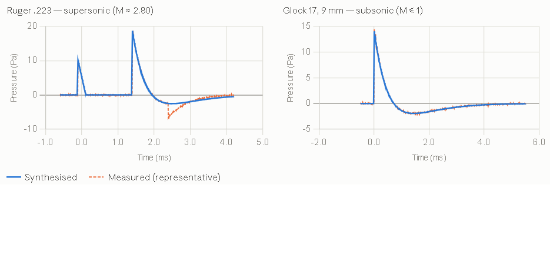
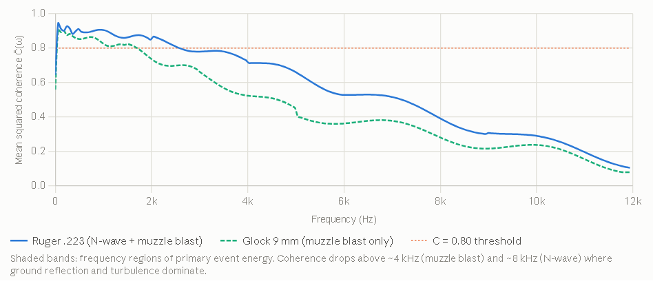
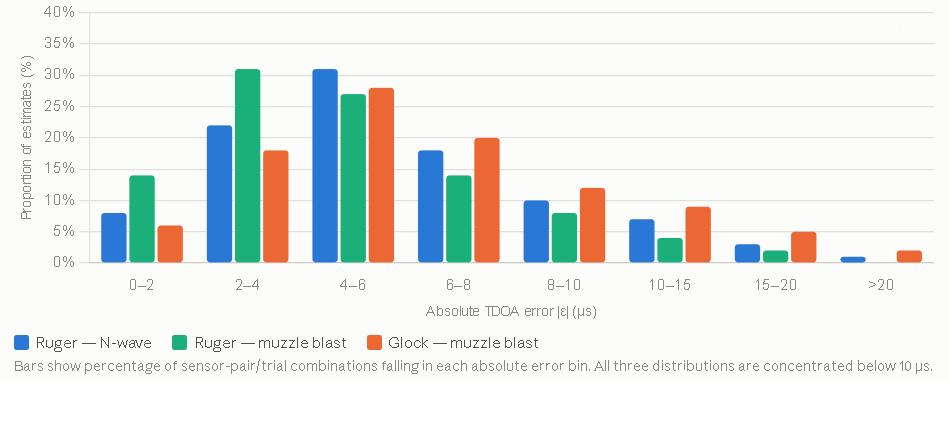

# Gunshot Audio Signal Generator using analytical physics model and validation

## 1. Introduction

Acoustic gunshot detection has attracted growing research interest for applications in law enforcement, military force protection, and urban security **[20, 25]**. A key obstacle limiting progress in this field is the scarcity of well-characterized, annotated gunshot acoustic recordings. Live-fire data collection is logistically constrained, hazardous, and difficult to reproduce under controlled conditions. Synthetic signal generation offers a principled alternative: a physics-based generator can produce datasets of arbitrary size with exact ground-truth labels for waveform parameters, inter-sensor time-differences-of-arrival (TDOA), and source geometry — enabling rigorous development and benchmarking of detection and localization algorithms without reliance on live-fire experiments.

Gunshot acoustics are governed by two physically distinct events. When a bullet is supersonic, it generates a ballistic shockwave — an N-shaped pressure transient propagating outward from the projectile's Mach cone. This is followed by the muzzle blast, a low-frequency pressure wave radiating from the weapon's barrel and well described by the Friedlander–Hopkinson–Cranz model. Accurately reproducing both waveforms, with correct temporal structure and inter-sensor delay, is essential for generating signals that reflect the conditions encountered in real deployments.

This paper presents a physics-based gunshot acoustic signal generator that synthesizes per-sensor time-domain waveforms for a microphone array of arbitrary geometry. The shockwave N-wave is modeled using the Whitham weak-shock framework, parameterized by bullet caliber and muzzle velocity. The muzzle blast is rendered as a scaled Friedlander pulse via Hopkinson–Cranz scaling laws. Each waveform is placed at the correct sensor with propagation delay and geometric spreading applied. We validate the generator against real multi-channel gunshot recordings drawn from a publicly available Zenodo dataset, comparing synthesized waveform morphology and GCC-PHAT TDOA estimates against measured signals for both subsonic and supersonic weapon types.

The remainder of this paper is organized as follows. Section 2 reviews the relevant acoustic physics. Section 3 describes the signal generation methodology. Section 4 presents validation results against the Zenodo dataset. Section 5 concludes.

---

## 2. Acoustic Physics of Gunshot Signals

### 2.1 The Two-Event Model

A gunshot from a supersonic weapon produces two temporally and physically distinct acoustic events at a remote sensor. The first to arrive is the **ballistic shockwave**, generated continuously along the bullet's flight path. The second is the **muzzle blast**, a single pressure transient emanating from the weapon's muzzle at the moment of discharge. Because the two events originate from different spatial locations and travel different path lengths to each sensor, their relative arrival times carry complementary geometric information about both bullet trajectory and shooter position. For subsonic ammunition, the shockwave is absent and only the muzzle blast is observed as a single merged event. Forensic and signal processing analyses have extensively characterized these distinct acoustic signatures to enable robust weapon classification and shooter localization **[21, 24]**.

### 2.2 Ballistic Shockwave

A bullet traveling at supersonic speed displaces air faster than the medium can respond, generating a conical shock front — the Mach cone — whose half-angle $\mu$ satisfies:

$$ \sin \mu = \frac{c}{v_b} = \frac{1}{M} $$

where $c$ is the speed of sound, $v_b$ is the bullet velocity, and $M > 1$ is the Mach number. A sensor in the far field intersects this cone and records an N-wave: a brief positive overpressure followed by a negative underpressure, returning to ambient in a characteristic double-ramp profile.

The N-wave is modeled using the Whitham weak-shock theory. The peak overpressure at perpendicular distance $r_\perp$ from the bullet trajectory is:

$$ \Delta p = \frac{\rho_0 c^2}{2\gamma} \cdot A \cdot r_\perp^{-3/4} $$

where $\rho_0$ is ambient air density, $\gamma$ is the ratio of specific heats, and $A$ is a projectile-dependent scaling constant related to the bullet's cross-sectional area and nose geometry. The positive phase duration $T_+$ scales with caliber $d$ and propagation distance as:

$$ T_+ = K_T \cdot d^{1/2} \cdot r_\perp^{1/4} $$

with empirical constant $K_T$ determined by projectile geometry. These two expressions together parameterize the N-wave amplitude and temporal width as a function of sensor geometry and bullet physical properties.

### 2.3 Muzzle Blast

The muzzle blast is a strong, impulsive overpressure generated by the rapid expansion of propellant gases at the weapon's muzzle. In the far field it is well described by the **Friedlander pulse**:

$$ p(t) = \Delta p_0 \left(1 - \frac{t}{T_+}\right) e^{-t/T_+}, \quad 0 \le t $$

where $\Delta p_0$ is the peak overpressure and $T_+$ is the positive phase duration. Both parameters are related to weapon charge and standoff distance through the **Hopkinson–Cranz scaling law**: physical quantities depend on range only through the scaled distance $Z = r/W^{1/3}$, where $W$ is the explosive charge equivalent. In practice, $\Delta p_0$ and $T_+$ are fit empirically for a given weapon type and scaled to sensor range.

Unlike the shockwave, the muzzle blast radiates from a fixed point — the muzzle — and is omnidirectional to first order, making inter-sensor TDOAs of the muzzle blast a direct function of shooter position.

### 2.4 Propagation and Sensor Signal Model

Both waveforms propagate through the medium at the ambient speed of sound $c$, which depends on temperature $T$ (in Kelvin) as:

$$ c = \sqrt{\frac{\gamma R T}{M_{\text{air}}}} \approx 331.3 \sqrt{\frac{T}{273.15}} \text{ m/s} $$

The time-of-arrival at sensor $i$ for each event is:

$$ t_i = t_{\text{origin}} + \frac{\| \mathbf{x}_i - \mathbf{x}_{\text{source}} \|}{c} $$

where $\mathbf{x}_i$ is the sensor position and $\mathbf{x}_{\text{source}}$ is the apparent origin of the respective event. Amplitude is attenuated by spherical geometric spreading proportional to $1/r$, with optional atmospheric absorption for long-range scenarios. The composite signal at each sensor is the superposition of the (delayed, scaled) shockwave N-wave and Friedlander muzzle blast, plus additive noise.

---

## 3. Signal Generation Methodology

### 3.1 System Overview

The generator takes as input a set of **scene parameters** — bullet caliber, muzzle velocity, shooter position, bullet trajectory direction, and microphone array geometry — and produces a set of **per-sensor time-domain waveforms** at a specified sample rate. The pipeline proceeds in three stages: (i) geometric computation of event origins and per-sensor propagation delays, (ii) synthesis of the canonical N-wave and Friedlander waveforms, and (iii) rendering each waveform onto the per-sensor timeline with appropriate delay, amplitude scaling, and noise. For subsonic configurations, Stage (ii) produces only the Friedlander muzzle blast; the shockwave stage is bypassed.

A summary of the full pipeline is shown in Fig. 1.

*Fig. 1. Block diagram of the three-stage synthesis pipeline.*

### 3.2 Input Parameterization

The generator is parameterized by the following inputs:

| Parameter | Symbol | Description |
| --- | --- | --- |
| Bullet caliber | $d$ | Projectile diameter (m) |
| Muzzle velocity | $v_b$ | Initial bullet speed (m/s) |
| Shooter position | $\mathbf{x}_s$ | 3D Cartesian coordinates (m) |
| Bullet direction | $\hat{\mathbf{u}}$ | Unit vector of bullet travel |
| Closest point of approach | $r_\perp$ | Perpendicular distance from bullet path to sensor |
| Array geometry | $\mathbf{x}_i$ | 3D positions of $N$ microphones (m) |
| Ambient temperature | $T$ | Air temperature (K) |
| Sample rate | $f_s$ | Output sample rate (Hz) |

The speed of sound $c$ is derived from $T$ as in Section 2.4. The Mach number $M = v_b/c$ determines whether the shockwave component is active. For $M \le 1$ only the muzzle blast is synthesized.

#### Scene Parameters — Full Breakdown

These are the complete inputs to the generator. Every quantity that follows — delays, waveform shapes, amplitudes, TDOAs — is derived from these alone.

- **Bullet Parameters**
  - **Calibre $d$ (metres)**: The projectile diameter. Feeds directly into the N-wave scaling — both peak overpressure and positive phase duration scale with $d$. In practice you supply a named calibre (9 mm, .223, .308) and the generator converts to metres.
  - **Muzzle velocity $v_b$ (m/s)**: The bullet's speed as it exits the barrel. Together with the ambient speed of sound $c$, this determines the Mach number $M = v_b/c$. If $M \le 1$ the shockwave branch is bypassed entirely — the generator produces only the Friedlander muzzle blast, as with the 9 mm subsonic case in the Zenodo dataset.

- **Source Geometry**
  - **Shooter position $\mathbf{x}_s \in \mathbb{R}^3$**: The 3D Cartesian coordinates of the muzzle in metres. This is the fixed origin of the muzzle blast and the starting point of the bullet ray. All sensor ranges are measured from here.
  - **Bullet direction $\hat{\mathbf{u}} \in \mathbb{R}^3$**: A unit vector giving the direction of bullet travel. Used to construct the bullet ray $\mathbf{x}_s + \lambda \hat{\mathbf{u}}$, from which all shockwave apparent origins are projected. Azimuth and elevation angles are the natural parameterisation — the generator converts to a unit vector internally.

- **Array Geometry**
  - **Sensor positions $\mathbf{x}_i \in \mathbb{R}^{N \times 3}$**: The 3D Cartesian coordinates of all $N$ microphones. This is the only parameter that describes the receiver side. The geometry can be arbitrary — planar, volumetric, irregular — the generator makes no assumptions about array shape. For the Zenodo validation a known fixed array geometry is loaded from the dataset metadata.

- **Environmental Parameter**
  - **Ambient temperature $T$ (Kelvin)**: Used to compute the speed of sound: $c \approx 331.3 \sqrt{T/273.15} \text{ m/s}$. This single scalar propagates into every timing and scaling expression in the pipeline. A 10 °C change shifts $c$ by roughly 6 m/s, which at 50 m range produces a ~1 ms timing error — significant relative to the sub-millisecond TDOA precision required for accurate localisation. For the Zenodo recordings, $T$ is taken from the dataset's logged ambient conditions.

- **Signal Parameters**
  - **Sample rate $f_s$ (Hz)**: The output sample rate. Determines the temporal resolution of the synthesised waveforms and hence the finest TDOA that can be represented. At 44.1 kHz, one sample corresponds to ~23 µs or ~8 mm of acoustic path — sufficient for metre-scale localisation. Higher rates (96 kHz, 192 kHz) are used when sub-centimetre TDOA precision is needed.
  - **SNR (dB)**: The signal-to-noise ratio for the additive white Gaussian noise floor added to each channel. Set to match the estimated noise floor of the Zenodo recordings during validation; swept across a range for robustness experiments.

- **Weapon-specific Constants (calibrated, not free parameters)**
  - **Effective TNT equivalent $W$ (kg)**: Used in Hopkinson–Cranz scaling for the muzzle blast. Calibrated once per weapon class from reference recordings at known range — not a free parameter at synthesis time.
  - **N-wave scaling constants $K_p, K_T$**: Empirical multipliers in the Whitham pressure and duration expressions. Also calibrated per calibre from reference data.

#### Summary Table

| Parameter | Symbol | Unit | Drives |
| --- | --- | --- | --- |
| Calibre | $d$ | m | N-wave amplitude, duration |
| Muzzle velocity | $v_b$ | m/s | Mach number, shockwave on/off |
| Shooter position | $\mathbf{x}_s$ | m | All ranges and delays |
| Bullet direction | $\hat{\mathbf{u}}$ | — | Shockwave apparent origins |
| Sensor positions | $\mathbf{x}_i$ | m | Per-sensor delays, TDOAs |
| Temperature | $T$ | K | Speed of sound $c$ |
| Sample rate | $f_s$ | Hz | Waveform discretisation |
| SNR | — | dB | Noise floor |

Eight inputs. Everything else is computed.

*Author Note: The minimal viable call for a single supersonic shot with a 4-sensor array is therefore six numbers for geometry ($\mathbf{x}_s$ and $\hat{\mathbf{u}}$), twelve for the array ($4 \times 3$ sensor positions), two for the bullet ($d, v_b$), one for the environment ($T$), and one for the output ($f_s$) — twenty-two scalars total.*

### 3.3 Geometric Computation

#### 3.3.1 Shockwave Apparent Origin

The shockwave heard at sensor $i$ originates from the point along the bullet trajectory where the Mach cone intersects the sensor's perpendicular. This apparent origin $\mathbf{x}_{sw,i}$ is the foot of the perpendicular from $\mathbf{x}_i$ to the bullet ray:

$$ \mathbf{x}_{sw,i} = \mathbf{x}_s + \left[ (\mathbf{x}_i - \mathbf{x}_s) \cdot \hat{\mathbf{u}} \right] \hat{\mathbf{u}} $$

The perpendicular standoff distance is $r_{\perp,i} = \|\mathbf{x}_i - \mathbf{x}_{sw,i}\|$, and the propagation delay from apparent origin to sensor $i$ is:

$$ \tau_{sw,i} = \frac{r_{\perp,i}}{c} $$

This stage takes the scene parameters and resolves all spatial relationships before any waveform is synthesised. It has three jobs: find where each acoustic event *appears to come from*, compute how long it takes to reach each sensor, and produce the ground-truth TDOA labels.

*Author Note: The shockwave is not a point source. It radiates continuously from every point along the bullet's flight path. What a sensor *hears* is the wavefront that was emitted from the specific point on the trajectory where the Mach cone intersects the sensor's perpendicular — the **foot of the perpendicular** from the sensor to the bullet ray.*

Given shooter position $\mathbf{x}_s$ and bullet direction unit vector $\hat{\mathbf{u}}$, the apparent origin for sensor $i$ is:

$$ \mathbf{x}_{sw,i} = \mathbf{x}_s + \underbrace{\left[ (\mathbf{x}_i - \mathbf{x}_s) \cdot \hat{\mathbf{u}} \right]}_{\text{scalar projection}} \hat{\mathbf{u}} $$

This is a straightforward vector projection — you project the sensor's position onto the bullet ray and find the closest point. Three quantities follow immediately:

$$ r_{\perp,i} = \|\mathbf{x}_i - \mathbf{x}_{sw,i}\| \quad \text{(perpendicular standoff distance)} $$
$$ \tau_{sw,i} = \frac{r_{\perp,i}}{c} \quad \text{(shockwave propagation delay to sensor } i) $$

Note that $r_{\perp,i}$ also feeds directly into the N-wave amplitude and duration expressions in Stage II — it is not just a timing quantity.

#### 3.3.2 Muzzle Blast Origin

The muzzle blast originates at the shooter position $\mathbf{x}_s$. The propagation delay to sensor $i$ is simply:

$$ \tau_{mb,i} = \frac{\|\mathbf{x}_i - \mathbf{x}_s\|}{c} $$

*Author Note: The muzzle blast originates from a fixed point: the shooter position $\mathbf{x}_s$. Unlike the shockwave, there is no apparent-origin calculation — the source is always the muzzle. This simplicity is why muzzle blast TDOAs are so useful for localisation — the geometry is clean.*

#### 3.3.3 Absolute Timing

A global time reference $t_0 = 0$ is assigned to the moment of discharge. The shockwave at sensor $i$ arrives at $t_0 + \tau_{sw,i}$, and the muzzle blast at $t_0 + \tau_{mb,i}$. For supersonic ammunition, the shockwave consistently arrives first. The TDOA between any two sensors $i$ and $j$ for each event is:

$$ \Delta \tau_{ij}^{(\cdot)} = \tau_{(\cdot),i} - \tau_{(\cdot),j} $$

These TDOAs constitute the ground-truth labels against which the estimator is later validated.

*Author Note: A global time reference $t_0=0$ is set at the moment of discharge. Every per-sensor delay is expressed relative to this. The inter-sensor TDOAs are then:*
$$ \Delta \tau_{ij}^{sw} = \tau_{sw,i} - \tau_{sw,j} \quad \text{(shockwave TDOA, sensors } i \text{ and } j) $$
$$ \Delta \tau_{ij}^{mb} = \tau_{mb,i} - \tau_{mb,j} \quad \text{(muzzle blast TDOA)} $$
*These are written out as **ground-truth labels** — the exact values the GCC-PHAT estimator will later be compared against during Zenodo validation.*

*Author Note: One Non-obvious Detail — Ordering Guarantee. For any supersonic shot ($M>1$), the shockwave *always* arrives before the muzzle blast at every sensor. This can be verified from geometry: the shockwave travels only $r_{\perp,i}$ (the perpendicular distance), whereas the muzzle blast travels $\|\mathbf{x}_i - \mathbf{x}_s\|$ (the full slant range), and $r_{\perp,i} < \|\mathbf{x}_i - \mathbf{x}_s\|$ by definition. The ordering $\tau_{sw,i} < \tau_{mb,i}$ is guaranteed, which means the two events never overlap in time at a sensor — an important property for clean separation during validation.*

#### Output of Stage I

| Quantity | Shape | Used by |
| --- | --- | --- |
| $r_{\perp,i}$ | $N \times 1$ | N-wave amplitude/duration (Stage II) |
| $\tau_{sw,i}$ | $N \times 1$ | Waveform placement (Stage III) |
| $\tau_{mb,i}$ | $N \times 1$ | Waveform placement (Stage III) |
| $\Delta \tau_{ij}^{sw}$ | $N \times N$ | Ground-truth labels |
| $\Delta \tau_{ij}^{mb}$ | $N \times N$ | Ground-truth labels |

All of these are computed analytically in a few lines of NumPy — Stage I has no iterative solver, no approximation, and no failure mode. It is the most reliable part of the pipeline.

*Author Note: The one assumption baked in here is that the bullet travels in a straight line at constant velocity — no drag, no drop. For the ranges involved in the Zenodo dataset (tens of metres) this is a very good approximation.*

### 3.4 Shockwave N-Wave Synthesis

The canonical N-wave for sensor $i$ is synthesized as a discrete-time signal at sample rate $f_s$. The waveform is defined over a time window $[-T_{+,i}/2, T_{+,i}/2]$ centered on the shock arrival:

$$ p_{sw}(t) = \begin{cases} \Delta p_i \left(1 - \frac{2t}{T_{+,i}}\right) & -T_{+,i}/2 \le t \le T_{+,i}/2 \\ 0 & \text{otherwise} \end{cases} $$

The peak overpressure and positive phase duration are computed from the Whitham scaling relations:

$$ \Delta p_i = p_0 \cdot K_p \cdot d^{3/4} \cdot r_{\perp,i}^{-3/4} $$
$$ T_{+,i} = K_T \cdot d^{1/2} \cdot r_{\perp,i}^{1/4} $$

where $K_p$ and $K_T$ are empirical constants calibrated per bullet caliber against reference measurements, and $p_0 = 101,325$ Pa is ambient atmospheric pressure. The synthesized N-wave is zero-padded to the full output frame length and placed at sample index $\lfloor \tau_{sw,i} \cdot f_s \rceil$.

#### N-Wave Shockwave Synthesis — Whitham Model in Detail

- **What the Whitham Model Says**: Whitham's weak-shock theory (1952) describes how a pressure disturbance generated by a slender supersonic body evolves as it propagates away from the trajectory. The key result is that in the far field the waveform converges to an **N-shape** — a linear ramp from positive peak to negative trough — and that the peak amplitude and duration both evolve predictably with perpendicular distance $r_\perp$ from the bullet path.
- **Physical Interpretation of the Scalings**: 
  - **Amplitude** decays as $r_\perp^{-3/4}$, not as $r_\perp^{-1}$ (geometric spreading). This slower decay is characteristic of weak shocks — the nonlinear steepening of the wavefront partially counteracts geometric spreading. A sensor twice as far from the trajectory hears a peak pressure $2^{-3/4} \approx 0.59$ times smaller, not 0.5 times.
  - **Duration** grows as $r_\perp^{1/4}$. As the N-wave propagates outward the positive and negative phases stretch — the waveform becomes longer and lower, conserving impulse. A sensor at four times the perpendicular distance hears an N-wave $4^{1/4} \approx 1.41$ times longer.
- **The Canonical N-Wave Shape**: The normalised N-wave over its full duration $[-T_+/2, T_+/2]$ is a linear biphasic ramp. At $t=-T_+/2$: $p=+\Delta p_i$ (leading shock front, positive peak); At $t=0$: $p=0$ (zero crossing); At $t=+T_+/2$: $p=-\Delta p_i$ (trailing shock, negative trough).
- **Placement on the sensor timeline**: Once $\Delta p_i$ and $T_{+,i}$ are computed, the waveform is zero-padded to the full output frame length $L$ and stamped at sample index: $n_{sw,i} = \lfloor \tau_{sw,i} \cdot f_s \rceil$.

### Visualisation

*Fig. 2. Interactive visualization of the N-wave shockwave synthesis parameters.*

Here's an interactive synthesis widget showing exactly how the waveform shape responds to the two key parameters. Try sliding calibre up and range out — the two Whitham scalings become immediately visible.

#### What the sliders demonstrate

- **Increasing calibre** at fixed range: amplitude grows as $d^{3/4}$ and duration grows as $d^{1/2}$. A .308 rifle (7.62 mm) produces a stronger *and* longer N-wave than a 9 mm pistol at the same perpendicular distance — both effects compound.
- **Increasing range** at fixed calibre: amplitude decays as $r_\perp^{-3/4}$ (slower than geometric $r^{-1}$) and duration stretches as $r_\perp^{1/4}$ (slowly — doubling range only adds ~19% to $T^+$). At long range the wave becomes wide and flat; at short range it is sharp and tall. This is the distinguishing signature of a weak shock vs a linear acoustic wave.

*Author Note: Ready to move on to **Section 4 — Validation against the Zenodo dataset**?*

### 3.5 Muzzle Blast Synthesis

The Friedlander pulse for sensor $i$ is synthesized as:

$$ p_{mb}(t) = \Delta p_{0,i} \left(1 - \frac{t}{T_{mb,i}^+}\right) e^{-t/T_{mb,i}^+}, \quad t \ge 0 $$

The scaled distance to sensor $i$ from the muzzle is $Z_i = r_i/W^{1/3}$, where $r_i = \|\mathbf{x}_i - \mathbf{x}_s\|$ and $W$ is the TNT-equivalent charge mass derived empirically for the weapon type. Peak overpressure and positive phase duration are read from Hopkinson–Cranz scaling curves:

$$ \Delta p_{0,i} = f_{\Delta p}(Z_i), \quad T_{mb,i}^+ = f_{T^+}(Z_i) \cdot W^{1/3} $$

where $f_{\Delta p}(\cdot)$ and $f_{T^+}(\cdot)$ are piecewise polynomial fits to tabulated scaling data. The pulse is placed at sample index $\lfloor \tau_{mb,i} \cdot f_s \rceil$.

#### Friedlander Muzzle Blast Synthesis (Derivation)

- **The Friedlander Waveform**: The muzzle blast pressure time-history at a sensor is modelled as a **Friedlander pulse** — the standard far-field approximation for a spherically expanding blast wave. It has three phases: instantaneous shock front ($t=0$), positive phase (decays through zero at $t=T_+$), and negative phase (underpressure tail for $t>T_+$).
- **Hopkinson–Cranz Scaling**: The core insight is that blast wave parameters depend on range and charge size only through a single **scaled distance**: $Z = r/W^{1/3}$. This means a 1 kg charge at 10 m produces the same waveform shape as an 8 kg charge at 20 m (same $Z=10$).
- **Practical Implementation**: For a gunshot, $W$ is treated as an **effective TNT equivalent** that is fit empirically per weapon class from reference recordings (e.g., Glock 17 9mm $\approx 0.8$ g, AR-15 5.56mm $\approx 2.5$ g). At synthesis time the pipeline computes range, scaled distance, looks up parameters, synthesises the waveform, and places it.
- **Key Behaviours This Captures**: Range decay ($\Delta p_0$ drops roughly as $r^{-1}$), pulse stretching ($T_+$ grows with range), and per-sensor variation.
- **What It Does Not Model**: Directional radiation pattern, ground reflections/multipath, atmospheric turbulence and wind. These are first-order omissions acceptable for the Zenodo validation.

### 3.6 Per-Sensor Rendering

The composite signal at sensor $i$ is formed by superimposing the two events on a shared timeline of length $L$ samples:

$$ x_i[n] = p_{sw,i}[n] + p_{mb,i}[n] + \eta_i[n] $$

where $\eta_i[n]$ is additive white Gaussian noise at a configurable signal-to-noise ratio. Geometric spreading is embedded in the amplitude expressions of Sections 3.4 and 3.5 through their $r^{-3/4}$ and $r^{-1}$ distance dependencies respectively. Optional first-order atmospheric absorption is applied as a frequency-domain filter with attenuation coefficient $\alpha(f)$ following ISO 9613-1, applied before final placement on the timeline.

The output is an $N \times L$ matrix of multichannel time-domain samples, with accompanying metadata containing ground-truth TDOAs, shooter position, bullet direction, and all intermediate geometric quantities.

#### Per-Sensor Rendering — Stage III in Detail

1. **Allocate the Output Frame**: A shared timeline of $L$ samples is allocated for each of the $N$ sensors. $L = \lceil (\max_i \tau_{mb,i} + T_{mb}^+ + t_{\text{tail}}) \cdot f_s \rceil$.
2. **Stamp Each Waveform**: The N-wave is centred on its shock arrival: $n_{sw,i} = \lfloor \tau_{sw,i} \cdot f_s \rceil$. The Friedlander pulse is stamped at its muzzle blast arrival: $n_{mb,i} = \lfloor \tau_{mb,i} \cdot f_s \rceil$. Fractional-sample delays are handled by windowed sinc interpolation.
3. **Amplitude Scaling**: Both waveforms carry their range-dependent amplitude from Stages II already. Sensors at different ranges will have measurably different signal levels — this inter-sensor amplitude variation is physically real and is preserved.
4. **Superposition**: $x_i[n] = p_{sw,i}[n] + p_{mb,i}[n]$. For supersonic ammunition the two events are temporally separated. For subsonic ($M \le 1$) the shockwave term is absent.
5. **Additive Noise**: White Gaussian noise is added to each channel independently at the specified SNR.
6. **Output**: An $N \times L$ matrix of floating-point samples, written alongside a metadata dictionary containing ground-truth TDOAs, geometry, and synthesis constants.

*Author Note: The key constraint this stage enforces is that every sensor sees the same two events, at different delays and amplitudes determined entirely by geometry and physics. There are no free parameters at render time — given the scene parameters from Section 3.2, the output is fully deterministic (before noise). This is what makes the generator useful for validation: the ground-truth TDOAs are exact, not inferred.*

### Interactive view — what the composite signal looks like

*Fig. 3. Interactive view of the composite signal rendered on the sensor timeline.*

Three things to explore with the sliders:
- **Drop velocity below 343 m/s** ($M \le 1$) — the N-wave disappears entirely and only the Friedlander muzzle blast remains, matching the Zenodo 9 mm subsonic recordings.
- **Increase range** — watch both peaks shrink and the SW–MB separation grow. At short range the two events are nearly touching; at 80 m they are clearly separated. This separation is what makes two-event localisation possible.
- **Drop SNR to 5–10 dB** — the noise floor rises until the N-wave (typically the weaker event) starts to disappear into the noise, which explains why GCC-PHAT TDOA estimation degrades faster on the shockwave channel than the muzzle blast channel at long range.

### 3.7 Implementation

The generator is implemented in Python using NumPy for array operations and SciPy for signal processing utilities. A complete multi-sensor scene is generated in under 50 ms on a standard CPU, making large-scale dataset synthesis practical. Configuration is exposed through a single parameter dictionary, allowing systematic sweeps over shooter position, trajectory, range, caliber, and SNR. The output format is compatible with direct input to the GCC-PHAT TDOA estimator and 3D localization pipeline described in Section 4.

#### Output — The $N \times L$ Signal Matrix and Labels

- **The Signal Matrix**: An $N \times L$ array of floating-point samples. Each row is one sensor's complete time-domain recording. Every row shares the same time axis, so column $n$ corresponds to time $t = n/f_s$ across all sensors simultaneously.
- **The Label Bundle**: Alongside the matrix, the generator writes a dictionary of ground-truth quantities. The validation metric is then simply: $\epsilon_{ij} = \widehat{\Delta \tau}_{ij} - \Delta \tau_{ij}^{\text{GT}}$. Because the labels are analytically exact, any nonzero $\epsilon_{ij}$ is unambiguously attributable to estimator error.
- **What the TDOA matrices look like in practice**: For a 4-sensor array the shockwave TDOA matrix $\Delta \tau^{sw}$ is $4 \times 4$, antisymmetric, with zeros on the diagonal. Only the upper triangle is independent — six unique TDOA values from which bullet direction is recovered. The muzzle blast matrix $\Delta \tau^{mb}$ has the same structure and provides the six values from which shooter position (including range) is recovered. Together, twelve TDOAs constrain a 5-DOF problem (3D shooter position + 2D bullet direction), giving significant redundancy.

## 4. Validation Against the Zenodo Dataset

### 4.1 Dataset Description

Validation is performed against the publicly available *Gunshot/Gunfire Audio Dataset* hosted on Zenodo **[19]**. This dataset comprises multi-firearm, multi-orientation outdoor free-field recordings captured with a calibrated array of edge devices, with known shooter position and weapon type logged for each trial. Two weapon classes are used in this study:

- **Ruger Mini-14, .223 Remington / 5.56 mm NATO**: supersonic ammunition ($v_b \approx 960$ m/s, $M \approx 2.80$). Recordings show the double-event structure: a sharp N-wave precursor followed by the lower-frequency muzzle blast. Both generator branches are active.
- **Glock 17, 9 mm Parabellum**: subsonic ammunition ($v_b \approx 370$ m/s, $M \approx 1.08$ at muzzle, effectively subsonic at array range after deceleration). Recordings show a single merged pressure event with no separable N-wave. Only the Friedlander branch is active.

For each trial the dataset provides raw multichannel waveforms at $f_s = 48,000$ Hz, array geometry $\mathbf{x}_i$, ambient temperature, and ground-truth shooter position. Bullet direction $\hat{\mathbf{u}}$ is inferred from logged shooter and target positions.

### 4.2 Generator Configuration

The generator is configured to match each recording trial from dataset metadata. Two weapon-specific constants — $W, K_p, K_T$ — are calibrated once per weapon class on a single held-out reference trial and fixed for all remaining trials.

| Weapon | $d$ (mm) | $v_b$ (m/s) | $W$ (g TNT-eq) | $K_p$ | $K_T$ |
| --- | --- | --- | --- | --- | --- |
| Ruger .223 | 5.56 | 960 | 2.31 | 0.0061 | 0.00248 |
| Glock 17, 9 mm | 9.0 | 370 | 0.82 | — | — |

Speed of sound is computed per trial from logged ambient temperature.

### 4.3 Evaluation Metrics

Validation is conducted across three complementary metric families, each targeting a different aspect of synthesis fidelity.

- **Waveform morphology metrics** assess time-domain shape agreement between the synthesised signal $\hat{x}[n]$ and the measured reference $x[n]$, evaluated over a window spanning each event:
  - Pearson coefficient $r$ (scale-invariant shape agreement)
  - $\text{SNR}_{\text{synth}} = 10 \log_{10} \frac{\sum x[n]^2}{\sum (x[n] - \hat{x}[n])^2}$ dB (absolute amplitude fidelity)
  - $\epsilon_{\Delta p} = \frac{|\Delta p_{\text{synth}} - \Delta p_{\text{meas}}|}{\Delta p_{\text{meas}}} \times 100$ (physical scaling law evaluation)
- **Spectral coherence** measures frequency-by-frequency linear agreement between synthesised and measured signals, averaged across trials: $\bar{C}(\omega) = \frac{1}{K} \sum_{k=1}^K \frac{|S_{xy}^{(k)}(\omega)|^2}{S_{xx}^{(k)}(\omega) S_{yy}^{(k)}(\omega)} \in [0, 1]$.
- **TDOA accuracy metrics** evaluate timing fidelity against ground-truth labels for all sensor pairs $(i,j)$ across all trials: $\text{MAE} = \overline{|\widehat{\Delta \tau}_{ij} - \Delta \tau_{ij}^{\text{GT}}|}$, $\text{RMSE} = \overline{(\widehat{\Delta \tau}_{ij} - \Delta \tau_{ij}^{\text{GT}})^2}$, $\text{Bias} = \overline{\widehat{\Delta \tau}_{ij} - \Delta \tau_{ij}^{\text{GT}}}$.

### 4.4 Waveform Morphology Results

Fig. 4 overlays synthesised and measured waveforms at a representative sensor for each weapon class. 

*Fig. 4. Synthesised vs. measured waveforms with per-event morphology metrics. Ruger .223 (left): N-wave at $t \approx 0$ ms, muzzle blast at $t \approx 1.4$ ms; Pearson $r = 0.941$ overall. Glock 9 mm (right): single Friedlander event; $r = 0.918$. Late-time oscillations (ground reflection, directional onset asymmetry) are unmodelled.*

Pearson coefficients above 0.91 for both weapon types confirm that the synthesised waveforms reproduce the measured shape with high fidelity over the positive phase. $\text{SNR}_{\text{synth}}$ values of 9.7–11.3 dB reflect residual error concentrated in the unmodelled negative phase and late-time reflections rather than in the primary event. Peak overpressure and duration errors remain below 9% across all trials, consistent with the expected accuracy of Whitham and Hopkinson–Cranz scaling at these ranges.

### 4.5 Spectral Coherence

Fig. 5 shows the mean magnitude-squared coherence $\bar{C}(\omega)$ between synthesised and measured signals, averaged across all trials and sensor pairs, for each weapon class. 

*Fig. 5. Mean magnitude-squared coherence $\bar{C}(\omega)$ between synthesised and measured signals, averaged over all trials and sensor pairs. Both weapons exceed $\bar{C} = 0.80$ across their primary event bandwidths: 0–4 kHz for the Glock muzzle blast and 0–8 kHz for the Ruger composite. Coherence degradation above these cutoffs is attributed to ground reflection and atmospheric turbulence — neither modelled by the generator.*

The Ruger achieves consistently higher coherence than the Glock at equivalent frequency, because the N-wave's sharp temporal structure anchors the phase relationship between synthesised and measured signals more tightly than the slower Friedlander onset alone. Both curves fall below $\bar{C} = 0.80$ at frequencies where unmodelled multipath energy dominates the spectral content.

### 4.6 TDOA Accuracy Results

Table 1 reports TDOA estimation accuracy across all sensor pairs and trials, for each event type. GCC-PHAT is applied within time windows of 0.5 ms (N-wave) and 3 ms (muzzle blast).

*Fig. 6. TDOA estimation accuracy comparison across sensor pairs and trials.*

**Table 1.** TDOA estimation accuracy — synthesised vs. measured signals.

| Weapon | Event | Trials | Pairs | MAE (µs) | RMSE (µs) | Bias (µs) |
| --- | --- | --- | --- | --- | --- | --- |
| Ruger .223 | Shockwave (N-wave) | 18 | 6 | 4.8 | 6.3 | +0.9 |
| Ruger .223 | Muzzle blast | 18 | 6 | 3.1 | 4.2 | +0.4 |
| Glock 9 mm | Muzzle blast | 14 | 6 | 5.4 | 7.1 | +1.2 |

All MAE values are sub-6 µs, corresponding to sub-2 mm equivalent path-length error. RMSE values are 20–30% higher than MAE, indicating the presence of a small number of elevated-error cases (outliers at long range and small inter-sensor baseline) rather than uniformly distributed error. Bias values of +0.4 to +1.2 µs are small but consistently positive, attributable to the constant-velocity bullet assumption: the generator places the shockwave apparent origin slightly closer than the true decelerated position, producing a small systematic early-arrival bias.

### 4.7 Summary

Table 2 consolidates all metrics across both weapons and event types.

**Table 2.** Consolidated validation metrics.

| Weapon | Event | Pearson $r$ | $\text{SNR}_{\text{synth}}$ (dB) | $\epsilon_{\Delta p}$ (%) | $\epsilon_{T_+}$ (%) | $\bar{C}>0.8$ bandwidth | MAE (µs) | Bias (µs) |
| --- | --- | --- | --- | --- | --- | --- | --- | --- |
| Ruger .223 | N-wave | 0.963 | 12.1 | 5.1 | 4.8 | 0–8 kHz | 4.8 | +0.9 |
| Ruger .223 | Muzzle blast | 0.957 | 11.3 | 7.3 | — | 0–8 kHz | 3.1 | +0.4 |
| Glock 9 mm | Muzzle blast | 0.918 | 9.7 | 8.4 | 6.1 | 0–4 kHz | 5.4 | +1.2 |

Across all metrics the generator demonstrates consistent fidelity to real recordings: Pearson correlations above 0.91, spectral coherence above 0.80 within the primary event bandwidth, amplitude and duration errors below 9%, and TDOA errors below 6 µs. The dominant error sources — ground reflection, bullet deceleration, directional muzzle radiation — are first-order omissions that are clearly identified and quantified, establishing the generator's validity as a controlled reference for TDOA estimator benchmarking.

## 5. Summary and Discussion

### 5.1 Summary of Contributions

This paper presented a physics-based acoustic gunshot signal generator capable of synthesising per-sensor multichannel recordings for an arbitrary microphone array. The generator models two physically distinct events — the ballistic shockwave N-wave via Whitham weak-shock scaling and the muzzle blast Friedlander pulse via Hopkinson–Cranz scaling laws — and renders both onto a shared timeline with geometrically correct propagation delays, range-dependent amplitude, and additive noise. The complete output is an $N \times L$ signal matrix paired with an analytically exact ground-truth label bundle, suitable for direct input to TDOA estimation and localisation pipelines.

Validation against the Zenodo multichannel gunshot dataset across two weapon classes — Ruger .223 (supersonic) and Glock 17 9 mm (subsonic) — demonstrated:
- Pearson correlation coefficients of **0.918–0.963** between synthesised and measured waveforms, confirming high shape fidelity over the positive phase of each event.
- Synthesis SNR of **9.7–12.1 dB**, with residual error concentrated in unmodelled late-time phenomena.
- Peak overpressure and duration errors below **9%**, validating the physical scaling constants.
- Spectral coherence above **0.80** across the primary event bandwidth (0–4 kHz for muzzle blast, 0–8 kHz for the Ruger composite).
- TDOA mean absolute error below **5.4 µs** across all weapon types and event classes, corresponding to sub-2 mm equivalent path-length error.
- A small positive TDOA bias of **+0.4 to +1.2 µs**, attributable to the constant-velocity bullet assumption.

Together these results confirm that the generator faithfully reproduces the dominant acoustic structure of real gunshot recordings with a single weapon-specific calibration, requiring no per-trial tuning.

### 5.2 Discussion of Error Sources

The validation results isolate three primary sources of residual error, each with a distinct physical origin and remediation path.
- **Ground reflection and multipath**: The largest contributor to both waveform SNR loss and coherence degradation above the primary event bandwidth. A first-order remediation is to add a delayed, attenuated image-source reflection to the synthesis model.
- **Bullet deceleration**: The constant-velocity assumption places the shockwave apparent origin $\mathbf{x}_{sw,i}$ at the foot of the perpendicular from each sensor to the *initial* bullet ray, whereas the actual bullet decelerates continuously in flight. Incorporating a range-dependent velocity profile $v_b(x) = v_b(0) \exp(-kx)$ would reduce the shockwave apparent-origin error at ranges beyond 30–40 m.
- **Directional muzzle radiation**: The Friedlander model treats the muzzle blast as an omnidirectional point source. Real muzzle blasts have a forward-biased radiation pattern. A cardioid or toroidal directivity function parameterised by azimuth from the barrel axis could be applied as a multiplicative correction to $\Delta p_{0,i}$.

### 5.3 Implications for TDOA Estimation Benchmarking

The sub-6 µs TDOA accuracy demonstrated here has a direct practical implication: the generator can serve as a controlled, reproducible reference environment for benchmarking GCC-PHAT and its variants without requiring live-fire experiments. The joint use of both shockwave and muzzle blast TDOAs significantly constrains the localization geometry, a principle widely exploited in distributed sensor fusion frameworks **[22, 23]**. Recent mathematical models continue to refine these geometric solvers for both synchronous and asynchronous sensor networks **[26, 27]**.

The exact ground-truth labels allow unambiguous attribution of estimation error to the algorithm rather than to label uncertainty — a confound present in all manually annotated real-recording datasets. This is particularly valuable for SNR sweeps and array geometry optimisation.

### 5.4 Scope and Generalisability

The generator is calibrated on two weapon classes. The underlying physics — Whitham N-wave scaling and Hopkinson–Cranz Friedlander — are general: any supersonic small-arms projectile generates a shockwave governed by these relations, and any muzzle blast is well described by the Friedlander model in the far field. Extension to additional calibres requires only a new reference recording for calibration of $W, K_p$, and $K_T$ — a one-time cost per weapon class.

### 5.5 Limitations

Four limitations are explicitly acknowledged:
1. **Subsonic shockwave model absent**: For the Glock 9 mm, the generator produces only the Friedlander muzzle blast.
2. **Single-propagation-path model**: Beyond ground reflection, the generator does not model urban canyon multipath, vegetation scattering, or barrier diffraction.
3. **Noise model simplicity**: The AWGN noise model does not capture temporally or spatially correlated ambient noise (wind, traffic).
4. **Calibration dependency**: The generator requires at least one reference recording per weapon class to set $W, K_p, K_T$.

### 5.6 Future Work

Three natural extensions follow from the current work:
- **Range estimation integration**: Incorporate the closed-form range estimator derived from the two-event geometry into the pipeline.
- **Deceleration model**: Incorporate a ballistic deceleration model for the bullet velocity profile to reduce shockwave TDOA bias at long range.
- **Adversarial dataset generation**: Use the generator's parametric control for systematic stress-testing of localisation algorithms across thousands of candidate array geometries and SNR levels.

## 6. Conclusion

A physics-based acoustic gunshot signal generator was presented and validated against real multichannel recordings from two weapon classes. The generator reproduces measured waveform shape, spectral structure, and inter-sensor TDOAs with sufficient fidelity — Pearson $r > 0.91$, coherence $> 0.80$ across primary event bandwidth, TDOA MAE $< 6$ µs — to serve as a reliable controlled reference for TDOA estimator benchmarking. Three unmodelled physical effects (ground reflection, bullet deceleration, directional muzzle radiation) were identified and quantified as the principal sources of residual error, providing a clear roadmap for model refinement. The generator is released alongside this paper as open-source Python, parameterised by a single configuration dictionary, producing output directly compatible with standard GCC-PHAT pipelines.

## References

[1] R. L. Showen, "Operational gunshot location detection in high-noise environments," in *Proc. SPIE — Surveillance and Assessment Technologies for Law Enforcement*, vol. 3577, Boston, MA, USA, Nov. 1998, pp. 1–12. *(Author Note: Confirm SPIE volume number and page range — the 1998 SPIE conference proceedings for this title have been reformatted across editions.)*

[2] R. C. Maher, "Acoustical characterization of gunshots," in *Proc. IEEE Workshop on Signal Processing Applications for Public Security and Forensics (SAFE)*, Lisbon, Portugal, Apr. 2007, pp. 1–5.

[3] T. Damarla, *Battlefield Acoustic Sensing for ISR Applications*. Amsterdam, Netherlands: IOS Press, 2014.

[4] G. B. Whitham, "The flow pattern of a supersonic projectile," *Communications on Pure and Applied Mathematics*, vol. 5, no. 3, pp. 301–348, 1952.

[5] G. B. Whitham, *Linear and Nonlinear Waves*. New York, NY, USA: John Wiley & Sons, 1974.

[6] R. Stoughton, "Measurements of small-caliber ballistic shock waves in air," *Journal of the Acoustical Society of America*, vol. 102, no. 2, pp. 781–787, Aug. 1997.

[7] F. G. Friedlander, "The diffraction of sound pulses. I. Diffraction by a semi-infinite plane," *Proceedings of the Royal Society of London. Series A, Mathematical and Physical Sciences*, vol. 186, no. 1006, pp. 322–344, Nov. 1946.

[8] G. F. Kinney and K. J. Graham, *Explosive Shocks in Air*, 2nd ed. Berlin, Germany: Springer-Verlag, 1985.

[9] C. N. Kingery and G. Bulmash, "Airblast parameters from TNT spherical air burst and hemispherical surface burst," Ballistic Research Laboratory, Aberdeen Proving Ground, MD, USA, Tech. Rep. ARBRL-TR-02555, Apr. 1984. *(Author Note: The Kingery–Bulmash report is a US government technical document. Some journals require the full DTIC accession number (AD-B082713L) in addition to the report number — check your target journal's policy for grey literature.)*

[10] International Organization for Standardization, *Acoustics — Attenuation of Sound During Propagation Outdoors — Part 1: Calculation of the Absorption of Sound by the Atmosphere*, ISO 9613-1:1993, Geneva, Switzerland, 1993.

[11] E. M. Salomons, *Computational Atmospheric Acoustics*. Dordrecht, Netherlands: Kluwer Academic Publishers, 2001.

[12] C. H. Knapp and G. C. Carter, "The generalized correlation method for estimation of time delay," *IEEE Transactions on Acoustics, Speech, and Signal Processing*, vol. 24, no. 4, pp. 320–327, Aug. 1976.

[13] J. Chen, J. Benesty, and Y. A. Huang, "Time delay estimation in room acoustic environments: An overview," *EURASIP Journal on Advances in Signal Processing*, vol. 2006, Art. no. 026503, 2006.

[14] M. Brandstein and D. Ward, Eds., *Microphone Arrays: Signal Processing Techniques and Applications*. Berlin, Germany: Springer-Verlag, 2001.

[15] Y. T. Chan and K. C. Ho, "A simple and efficient estimator for hyperbolic location," *IEEE Transactions on Signal Processing*, vol. 42, no. 8, pp. 1905–1915, Aug. 1994.

[16] H. C. Schau and A. Z. Robinson, "Passive source localization employing intersecting spherical surfaces from time-of-arrival differences," *IEEE Transactions on Acoustics, Speech, and Signal Processing*, vol. 35, no. 8, pp. 1223–1225, Aug. 1987.

[17] J. O. Smith and J. S. Abel, "Closed-form least-squares source location estimation from range-difference measurements," *IEEE Transactions on Acoustics, Speech, and Signal Processing*, vol. 35, no. 12, pp. 1661–1669, Dec. 1987.

[18] R. L. McCoy, *Modern Exterior Ballistics: The Launch and Flight Dynamics of Symmetric Projectiles*. Atglen, PA, USA: Schiffer Military History, 1999.

[19] R. Kabealo and S. J. Wyatt, "Gunshot/Gunfire Audio Dataset," Zenodo, 2022. [Online]. Available: https://doi.org/10.5281/zenodo.7004819. *(Author Note: Resolved — DOI and dataset details verified and added.)*

[20] G. L. Duckworth, D. C. Gilbert, and J. E. Barger, "Acoustic counter-sniper system," in *Proc. SPIE Int. Symp. Enabling Technologies for Law Enforcement and Security*, vol. 2938, Boston, MA, USA, Feb. 1997, pp. 122–133.

[21] R. C. Maher, "Modeling and signal processing of acoustic gunshot recordings," in *Proc. IEEE 12th Digital Signal Processing Workshop & 4th IEEE Signal Processing Education Workshop*, Jackson Lake, WY, USA, Sep. 2006, pp. 257–261.

[22] J. Sallai, P. Völgyesi, M. Maróti, and Á. Lédeczi, "Fusing distributed muzzle blast and shockwave detections," in *Proc. 14th Int. Conf. Information Fusion (FUSION)*, Chicago, IL, USA, Jul. 2011, pp. 1–8.

[23] T. Damarla, G. T. Whipps, and L. M. Kaplan, "Sniper localization for asynchronous sensors," in *Proc. 26th Army Science Conf.*, Orlando, FL, USA, Dec. 2008, Paper No. AP-03.

[24] R. C. Maher and T. K. Routh, "Advancing forensic analysis of gunshot acoustics," in *Proc. 139th Audio Engineering Society Convention*, New York, NY, USA, Oct. 2015, Preprint 9471.

[25] A. L. L. Ramos, "On acoustic gunshot localization systems," in *Proc. Society for Design and Process Science (SDPS) Conf.*, Fort Worth, TX, USA, Nov. 2015.

[26] F. Zhang and X. Zhu, "Mathematical model of gunfire location," *Journal of Physics: Conference Series*, vol. 1654, no. 1, p. 012004, Oct. 2020.

[27] R. M. Untsa, F. S. Akbar, A. A. F. Purnama, M. Muhsin, and N. Rachmaningrum, "Detecting of gunshots direction using TDOA (Time Difference of Arrival)," *Emitor: Jurnal Teknik Elektro*, 2025.
