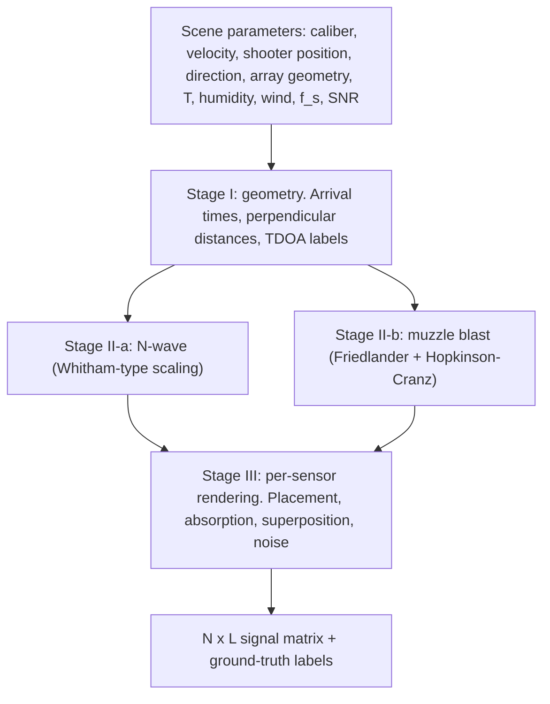

# Physics-Based Gunshot Acoustic Signal Generation Using Analytical Shockwave and Muzzle-Blast Models

> **Draft status.** Baseline: the txt draft. Restored from the PDF: pipeline and geometry figures, ordering proof, ground-truth labels, metric formulas, timing validation, quantitative atmospheric content.
> **All measured values are placeholders written as `[ ]`.** The numbers in earlier drafts were not computed from recordings and have been removed. Items marked **TODO** need action. See the checklist at the end (delete before submission).

---

Author : Rizki Ardianto (edes) ;   Denny Darlis ;   Saladin Prawirasastra (bibin)

Telkom University, Bandung, Indonesia

---

## Abstract

The development of acoustic gunshot detection systems is constrained by the limited availability of well-characterized multichannel gunshot recordings acquired under controlled conditions. Live-fire data collection is costly, difficult to reproduce, and subject to safety and logistical constraints. This paper presents a physics-based acoustic signal generator that synthesizes multichannel gunshot recordings from a compact set of physical, geometric, environmental, and sensor parameters.

The generator models the two dominant acoustic components of a gunshot. For supersonic projectiles, the ballistic shockwave is represented as an N-wave generated by the projectile Mach cone, with amplitude and duration described by a Whitham-inspired weak-shock scaling model. The muzzle blast is represented by a Friedlander waveform combined with Hopkinson–Cranz scaling and an empirically calibrated equivalent-TNT parameter. Shockwave arrival times follow a closed-form Mach-cone expression that accounts for both projectile flight and acoustic propagation, and the generator outputs exact ground-truth arrival times and time differences of arrival (TDOAs) for arbitrary three-dimensional sensor geometry. Range-dependent amplitudes, ISO 9613-1 atmospheric absorption, optional first-order wind effects, fractional-sample delays, and configurable noise are included.

The generator is evaluated against outdoor recordings from the publicly available Gunshot/Gunfire Audio Dataset for two weapon classes: a supersonic Ruger Mini-14 firing .223/5.56 mm ammunition and a Glock 17 firing 9 mm ammunition. Validation considers waveform morphology, amplitude and duration agreement, spectral similarity, and arrival-time agreement. Pearson correlations of `[ ]`–`[ ]`, spectral log-distances of `[ ]` dB, and mean absolute timing errors of `[ ]` µs were obtained on `[ ]` held-out recordings. The results indicate whether an analytical model can reproduce the dominant temporal, spectral, and timing characteristics of measured gunshot signals while providing deterministic, geometry-consistent multichannel synthetic data.

**Keywords:** gunshot acoustics, acoustic signal generation, ballistic shockwave, N-wave, Friedlander waveform, Hopkinson–Cranz scaling, Whitham theory, synthetic acoustic data, microphone array

---

## 1. Introduction

Acoustic gunshot sensing has applications in public safety, military sensing, forensic analysis, and distributed acoustic monitoring [1]–[6]. Development and evaluation of these systems require representative recordings with sufficient variation in weapon type, projectile trajectory, source distance, sensor geometry, and environmental conditions.

A major limitation is the availability of controlled multichannel recordings. Live-fire measurements are logistically demanding and difficult to reproduce under identical geometric and environmental conditions. Synthetic signal generation provides a complementary approach in which the physical parameters of an acoustic event are explicitly controlled and the ground truth is known exactly.

A supersonic projectile produces more than a single acoustic pulse. At a remote sensor, two dominant components can occur: a ballistic shockwave generated continuously along the projectile trajectory, and a muzzle blast originating near the muzzle. The shockwave is associated with the Mach cone surrounding the projectile. Away from the trajectory it is approximated by an N-wave, a positive overpressure followed by a negative phase [7]–[9], and its arrival time depends jointly on projectile flight time and acoustic propagation from the relevant Mach-cone emission point. The muzzle blast is produced by the rapid expansion of propellant gases. At sufficiently large standoff distances its waveform is approximated by a Friedlander-type pulse, with amplitude and duration related to scaled distance through Hopkinson–Cranz blast-wave scaling [10]–[12].

**Related work.** Geometric descriptions of gunshot acoustics, including the shock ray launched from a point on the bullet path, were given by Maher [5]. Synthetic gunshot generation using a geometric approach has been reported for training and evaluating gunshot classification methods [13], and a MATLAB synthesizer producing microphone-array gunshot signals from a gunshot signal and descriptive parameters was described in [14]. The present generator differs in being fully analytic (no recorded template), in providing exact ground-truth arrival times and TDOAs for arbitrary three-dimensional arrays, in including absorption and first-order wind, and in being validated against measured multichannel recordings in the time, frequency, and timing domains.

> **TODO:** read [13] and [14] in full and confirm each stated difference before submission.

The contributions of this paper are:

1. a closed-form Mach-cone arrival-time expression for arbitrary three-dimensional geometry, adopted from the geometric treatment in [5], with a validity and ordering analysis and exact ground-truth TDOA labels;
2. analytic N-wave and Friedlander synthesis driven by a small number of calibrated weapon constants;
3. first-order atmospheric propagation (ISO 9613-1 absorption and a uniform-wind correction);
4. deterministic multichannel output with fractional-sample delays and configurable noise; and
5. validation against measured multichannel recordings in the waveform, spectral, and timing domains, including comparison with a closest-point-of-approach timing approximation.

The work focuses on signal generation and validation. Detection and source-localization algorithms are outside the scope of this paper. Section 2 presents the acoustic model, Section 3 the generation method, Section 4 the validation setup, Section 5 the results, Section 6 the discussion, Section 7 limitations and future work, and Section 8 concludes.

---

## 2. Acoustic Model

### 2.1 Two-Event Gunshot Model

The generator represents a gunshot using two potentially distinct acoustic events: a ballistic shockwave produced by a supersonic projectile, and a muzzle blast produced at the muzzle. For a sufficiently supersonic projectile the shockwave arrives before the muzzle blast at sensors that lie within the region reached by the Mach cone (Section 3.2). For projectiles whose Mach number does not exceed the practical threshold $M_{th}$ (Section 3.7), the shockwave branch is disabled and only the muzzle blast is generated.

The synthesized pressure at sensor $i$ is

$$
x_i(t) = p_{\mathrm{sw},i}(t) + p_{\mathrm{mb},i}(t) + \eta_i(t),
$$

where $p_{\mathrm{sw},i}$ is the shockwave contribution, $p_{\mathrm{mb},i}$ the muzzle-blast contribution, and $\eta_i$ additive noise.

### 2.2 Ballistic Shockwave

A projectile with velocity $v_b$ in air with sound speed $c$ has Mach number $M = v_b/c$. For $M > 1$ it generates a Mach cone with half-angle $\mu$,

$$
\sin\mu = \frac{1}{M}.
$$

A sensor away from the trajectory receives an N-shaped transient. Whitham's weak-shock theory predicts that its peak overpressure decays as $r_\perp^{-3/4}$ and its duration grows as $r_\perp^{1/4}$ with perpendicular distance $r_\perp$ from the trajectory [7], [8]. Writing the peak overpressure as $\Delta p = \tfrac{\rho_0 c^2}{2\gamma} A\, r_\perp^{-3/4}$ with $A \propto d^{3/4}$ for geometrically similar projectiles of diameter $d$, and absorbing the remaining prefactor into an empirical constant $K_p$, gives the practical parameterization

$$
\Delta p_i = p_0\, K_p\, d^{3/4}\, r_{\perp,i}^{-3/4}, \qquad p_0 = \frac{\rho_0 c^2}{\gamma},
$$

where $\rho_0$ is air density and $\gamma$ the ratio of specific heats. The total N-wave duration is modeled as

$$
T_{N,i} = K_T\, d^{1/2}\, r_{\perp,i}^{1/4},
$$

with $K_T$ a second empirical constant. Since $\Delta p \cdot T_N \propto r_\perp^{-1/2}$, the N-wave weakens and lengthens with range.

> **TODO (exponent):** under the same geometric-similarity assumption used for $A$, the classical Whitham results give a duration scaling closer to $d^{3/4}$ than $d^{1/2}$. Either adopt $d^{3/4}$ and re-fit $K_T$, or state that the $d^{1/2}$ dependence is purely empirical.

The formulation is called *Whitham-inspired* because the practical implementation uses calibrated scaling constants rather than the full nonlinear wave solution.

### 2.3 Muzzle Blast

The muzzle blast is modeled with the Friedlander waveform. For positive peak overpressure $\Delta p_{0,i}$ and characteristic duration $T_{\mathrm{mb},i}$,

$$
p_{\mathrm{mb},i}(t) = \Delta p_{0,i}\left(1 - \frac{t}{T_{\mathrm{mb},i}}\right) e^{-t/T_{\mathrm{mb},i}}, \qquad t \ge 0,
$$

which contains a positive phase ($t < T_{\mathrm{mb},i}$) and a subsequent negative phase.

Range dependence uses the Hopkinson–Cranz scaled distance

$$
Z_i = \frac{r_i}{W^{1/3}},
$$

where $r_i = \lVert \mathbf{x}_i - \mathbf{x}_s \rVert$ is the muzzle-to-sensor distance and $W$ (in kg in all formulas) is an empirically determined equivalent-TNT charge. Here $W$ is an empirical scaling surrogate, not a claim that the muzzle blast is physically equivalent to a spherical TNT explosion. Peak pressure and duration are obtained as

$$
\Delta p_{0,i} = f_{\Delta p}(Z_i), \qquad T_{\mathrm{mb},i} = f_{T}(Z_i)\, W^{1/3},
$$

where $f_{\Delta p}$ and $f_T$ are fits to Kingery–Bulmash tabulations [12]. For $W$ of order one gram and $r = 15$–$50$ m, $Z \approx 110$–$380\ \mathrm{m\,kg^{-1/3}}$, which lies beyond the usual tabulated range, so the fits are extrapolated.

> **TODO:** state the extrapolation rule used for $f_{\Delta p}$ and $f_T$ and confirm the tabulated $Z$ range.

Nominal weapon parameters for the validation weapons:

| Weapon | Bullet diameter | Nominal muzzle velocity | Equivalent TNT $W$ |
|---|---|---|---|
| Ruger Mini-14 | 5.56 mm (.223) | ≈ 960 m/s | `[ ]` g |
| Glock 17 | 9 mm | ≈ 370 m/s | `[ ]` g |

$W$ is calibrated from a reference recording and then held fixed for the weapon class (Section 4.2).

### 2.4 Atmospheric Propagation

**Speed of sound.** The speed of sound is computed from ambient temperature $T$ (kelvin):

$$
c \approx 331.3\sqrt{\frac{T}{273.15}}\ \ \mathrm{m/s}.
$$

A 10 °C error in $T$ changes $c$ by about 6 m/s (1.7 %). All delays and TDOAs scale by the same fraction, giving up to about 15 µs on a 0.3 m baseline.

**Absorption.** The generator applies frequency-dependent absorption following ISO 9613-1 [15]. For a propagation distance $r$, the amplitude spectrum is multiplied by

$$
A(f,r) = 10^{-\alpha(f)\,r/20},
$$

with $\alpha(f)$ in dB/m,

$$
\alpha(f) = 8.686\, f^2 \left\{ 1.84\times10^{-11}\left(\frac{p_a}{p_r}\right)^{-1}\left(\frac{T}{T_0}\right)^{1/2} + \left(\frac{T}{T_0}\right)^{-5/2}\left[ \frac{0.01275\, e^{-2239.1/T}}{f_{rO} + f^2/f_{rO}} + \frac{0.1068\, e^{-3352/T}}{f_{rN} + f^2/f_{rN}} \right] \right\},
$$

where $T_0 = 293.15$ K, $p_r = 101.325$ kPa, and $p_a$ is the ambient pressure. The oxygen and nitrogen relaxation frequencies are

$$
f_{rO} = \frac{p_a}{p_r}\left[24 + 4.04\times10^{4}\, h\,\frac{0.02 + h}{0.391 + h}\right], \qquad
f_{rN} = \frac{p_a}{p_r}\left(\frac{T}{T_0}\right)^{-1/2}\left[9 + 280\, h\, e^{-4.170\left[(T/T_0)^{-1/3} - 1\right]}\right],
$$

with the water-vapor molar concentration $h = h_r\, 10^{C}\, (p_r/p_a)$ in percent, relative humidity $h_r$ in percent, $C = -6.8346\,(273.16/T)^{1.261} + 4.6151$.

Representative values at 20 °C and 50 % relative humidity (standard pressure) give the following attenuation:

| $f$ | $\alpha$ (dB/km) | 15 m (dB) | 50 m (dB) |
|---|---|---|---|
| 1 kHz | 4.7 | 0.07 | 0.23 |
| 2 kHz | 9.9 | 0.15 | 0.49 |
| 4 kHz | 29.7 | 0.44 | 1.48 |
| 8 kHz | 105.3 | 1.58 | 5.26 |

Absorption therefore matters mainly as a high-frequency roll-off of the N-wave at the upper end of the validation range.

### 2.5 First-Order Wind Correction

For a uniform horizontal wind $\mathbf{v}_w$, the effective propagation speed along the source-to-sensor direction $\hat{\mathbf{r}}_i$ is approximated by

$$
c_{\mathrm{eff},i} = c + \mathbf{v}_w \cdot \hat{\mathbf{r}}_i, \qquad
\hat{\mathbf{r}}_i = \frac{\mathbf{x}_i - \mathbf{x}_s}{\lVert \mathbf{x}_i - \mathbf{x}_s \rVert},
$$

and the propagation delay becomes $\tau_i = \lVert \mathbf{x}_i - \mathbf{x}_s\rVert / c_{\mathrm{eff},i}$.

For two sensors separated by $d$, the wind-induced TDOA error is bounded by

$$
\Delta\tau_{ij}^{\mathrm{wind}} \lesssim \frac{d\,\lvert\mathbf{v}_w\rvert}{c^2},
$$

attained when the source direction and wind are aligned with the baseline. A 1 m/s wind gives at most 2.5 µs for $d = 0.3$ m and 25 µs for $d = 3$ m. A 5 m/s wind with $d = 3$ m gives about 127 µs. Wind therefore must be recorded, or the trials restricted to calm conditions, whenever the array baseline is large compared with the timing accuracy being claimed.

This is a weak-wind, spatially uniform approximation. It does not modify the Mach-cone geometry for a spatially varying flow field. Temperature-gradient refraction and turbulence are not modeled; ray-based treatments are available [16]. Over ranges below about 50 m they are expected to be small compared with the wind term, but no bound is derived here; they are treated as limitations of the present implementation.

---

## 3. Signal Generation Method

### 3.1 System Architecture

The generator has three stages (Fig. 1).

**Fig. 1.** Signal generation pipeline. Stage II-a is bypassed when $M \le M_{th}$ or when a sensor lies outside the region reached by the Mach cone.

The generator accepts the following inputs:

| Parameter | Symbol | Description |
|---|---|---|
| Bullet diameter | $d$ | m |
| Muzzle velocity | $v_b$ | m/s |
| Shooter (muzzle) position | $\mathbf{x}_s$ | 3-D Cartesian, m |
| Bullet direction | $\hat{\mathbf{u}}$ | unit vector |
| Array geometry | $\{\mathbf{x}_i\}_{i=1}^{N}$ | sensor positions, m |
| Ambient temperature | $T$ | K |
| Relative humidity | $h_r$ | % (required for absorption) |
| Wind vector | $\mathbf{v}_w$ | m/s, optional |
| Sample rate | $f_s$ | Hz |
| Target SNR | — | dB |

All sensor-specific waveform parameters are derived from these scene parameters and the calibrated weapon constants ($W$, $K_p$, $K_T$).

### 3.2 Shockwave Arrival-Time Geometry

Fig. 2 shows the geometry. Define the relative sensor position

$$
\mathbf{q}_i = \mathbf{x}_i - \mathbf{x}_s,
$$

the along-track coordinate $a_i = \mathbf{q}_i \cdot \hat{\mathbf{u}}$, and the perpendicular distance to the infinite trajectory

$$
r_{\perp,i} = \lVert \mathbf{q}_i - a_i \hat{\mathbf{u}} \rVert.
$$

**Fig. 2.** Geometry in the plane of the trajectory and sensor $i$ (drawn for $M = 2$). The shock ray from the emission point $\mathbf{x}_{\mathrm{sw},i}$ is perpendicular to the Mach front; the muzzle-blast path is the vector $\mathbf{q}_i$. The bullet is shown at the instant the shock reaches the sensor.

For a constant projectile velocity, let $\beta = \sqrt{M^2 - 1}$. The shock that reaches sensor $i$ first minimizes the total travel time

$$
t(s) = \frac{s}{v_b} + \frac{\sqrt{(a_i - s)^2 + r_{\perp,i}^2}}{c}
$$

over the emission coordinate $s$ along the trajectory. The stationarity condition gives $(a_i - s)/R = 1/M$ with $R$ the ray length, hence the emission coordinate

$$
s_i = a_i - \frac{r_{\perp,i}}{\beta}, \qquad \mathbf{x}_{\mathrm{sw},i} = \mathbf{x}_s + s_i \hat{\mathbf{u}},
$$

and the acoustic path

$$
R_{\mathrm{sw},i} = \lVert \mathbf{x}_i - \mathbf{x}_{\mathrm{sw},i} \rVert = \frac{M\, r_{\perp,i}}{\sqrt{M^2 - 1}}.
$$

The shock ray makes angle $\theta = 90^\circ - \mu$ with the trajectory, $\cos\theta = 1/M$, and is perpendicular to the Mach front. The shockwave arrival delay, with the instant of discharge as $t_0 = 0$, is

$$
\tau_{\mathrm{sw},i} = \frac{s_i}{v_b} + \frac{R_{\mathrm{sw},i}}{c}
\quad\Longrightarrow\quad
\boxed{\ \tau_{\mathrm{sw},i} = \frac{a_i + r_{\perp,i}\sqrt{M^2 - 1}}{M\,c}\ }
$$

for a straight, constant-velocity trajectory in a stationary, homogeneous medium.

**Validity.** The emission point must lie on the forward trajectory, $s_i \ge 0$ (that is, $a_i \ge r_{\perp,i}/\beta$). When $s_i < 0$ the sensor lies outside the region reached by the Mach cone and receives no shockwave; the generator sets $p_{\mathrm{sw},i} = 0$ for that sensor rather than interpreting the negative coordinate as a physical emission point.

**Comparison with the closest-point-of-approach approximation.** A common simplification assumes the shock is emitted when the bullet passes the foot of the perpendicular, $\tau_{\mathrm{cpa},i} = a_i/v_b + r_{\perp,i}/c$. The difference is

$$
\tau_{\mathrm{cpa},i} - \tau_{\mathrm{sw},i} = \frac{r_{\perp,i}}{c}\left(1 - \sqrt{1 - 1/M^2}\right) \ge 0,
$$

for example about 6.6 % of $r_{\perp,i}/c$ at $M = 2.8$ (about 1.9 ms at $r_{\perp,i} = 10$ m). Section 5.3 tests this against measurements.

**Wind.** The closed form assumes still air. With wind, the muzzle-blast delay uses $c_{\mathrm{eff},i}$ exactly. For the shockwave, wind is applied to the acoustic leg only, $\tau_{\mathrm{sw},i} \approx s_i/v_b + R_{\mathrm{sw},i}/c_{\mathrm{eff},i}$, as a first-order approximation.

**Ordering.** For $s_i \ge 0$ and still air,

$$
c\,(\tau_{\mathrm{mb},i} - \tau_{\mathrm{sw},i}) = \sqrt{a_i^2 + r_{\perp,i}^2} - \frac{a_i + r_{\perp,i}\beta}{M} \ge 0.
$$

By the Cauchy–Schwarz inequality, $a_i + r_{\perp,i}\beta \le M\sqrt{a_i^2 + r_{\perp,i}^2}$ (because $1 + \beta^2 = M^2$), with equality only at $s_i = 0$. The shockwave therefore arrives first, and its acoustic path is shorter, $R_{\mathrm{sw},i} \le \lVert\mathbf{q}_i\rVert$. The shock arrives earlier because the path saving outweighs its later emission time. The two events do not overlap at sensor $i$ when $\tau_{\mathrm{mb},i} - \tau_{\mathrm{sw},i} > T_{N,i}$; the minimum separation in the validation set is `[ ]` ms.

**Ground-truth labels.** The arrival times above define exact labels for every sensor pair:

$$
\Delta\tau_{ij}^{\mathrm{sw}} = \tau_{\mathrm{sw},i} - \tau_{\mathrm{sw},j}, \qquad
\Delta\tau_{ij}^{\mathrm{mb}} = \tau_{\mathrm{mb},i} - \tau_{\mathrm{mb},j}.
$$

For $N$ sensors each event has $N - 1$ independent TDOAs; the remaining pairs follow by subtraction.

### 3.3 Muzzle-Blast Arrival Time

The muzzle blast originates at the fixed muzzle position $\mathbf{x}_s$. Without wind,

$$
\tau_{\mathrm{mb},i} = \frac{r_i}{c}, \qquad r_i = \lVert\mathbf{x}_i - \mathbf{x}_s\rVert,
$$

and with the first-order wind model $\tau_{\mathrm{mb},i} = r_i / c_{\mathrm{eff},i}$. Shockwave and muzzle-blast arrival times are computed independently for every sensor.

### 3.4 Shockwave Waveform Synthesis

The N-wave is a linearized positive-to-negative ramp in local time $t' = t - \tau_{\mathrm{sw},i}$:

$$
p_{\mathrm{sw},i}(t') = \Delta p_i\left(1 - \frac{2t'}{T_{N,i}}\right), \qquad 0 \le t' \le T_{N,i}.
$$

It equals $+\Delta p_i$ at the leading shock front ($t' = 0$), crosses zero at $t' = T_{N,i}/2$, and reaches $-\Delta p_i$ at $t' = T_{N,i}$. $T_{N,i}$ is therefore the total N-wave duration, not the positive-phase duration. The leading front is placed at the arrival sample. This simplified profile preserves the positive/negative structure while keeping the generator lightweight.

### 3.5 Muzzle-Blast Waveform Synthesis

For each sensor the generator computes the muzzle range $r_i$, the scaled distance $Z_i$, the peak pressure $\Delta p_{0,i}$, and the duration $T_{\mathrm{mb},i}$ (Section 2.3). The Friedlander waveform is shifted to $\tau_{\mathrm{mb},i}$. The negative phase is retained because an acoustic transient is a pressure fluctuation about ambient pressure. The model is a compact approximation and does not reproduce late-time blast-wave structure.

### 3.6 Per-Sensor Rendering

The output is an $N \times L$ matrix. For each sensor the generator:

1. allocates a common frame of
   $$L = \left\lceil \left(\max_i \tau_{\mathrm{mb},i} + T_{\mathrm{mb},\max} + t_{\mathrm{tail}}\right) f_s \right\rceil$$
   samples, with a post-blast margin $t_{\mathrm{tail}}$ of 50–100 ms;
2. computes sensor-specific arrival times (Sections 3.2–3.3);
3. places each event at its arrival time, resolving fractional-sample delays by windowed-sinc interpolation, so the sampling frequency defines the discrete grid but does not limit timing accuracy;
4. applies atmospheric absorption to each event in the frequency domain using its own path length ($R_{\mathrm{sw},i}$ for the shockwave, $r_i$ for the blast):
   $$X^{\mathrm{abs}}(f) = X(f)\cdot 10^{-\alpha(f)\,d/20};$$
5. superposes the events, $x_i[n] = p_{\mathrm{sw},i}[n] + p_{\mathrm{mb},i}[n]$; and
6. adds independent white Gaussian noise $\eta_i[n]$ with variance
   $$\sigma_\eta^2 = \frac{\max_i \tfrac{1}{L}\sum_n x_i[n]^2}{10^{\mathrm{SNR}/10}}.$$

Range-dependent amplitude comes from the Stage II expressions ($r_\perp^{-3/4}$ for the N-wave, $f_{\Delta p}(Z_i)$ for the blast); no additional gain is applied at rendering. Absorption is applied before noise so that the noise floor is not attenuated. For a specified scene and parameter set the output is deterministic before the noise is added.

### 3.7 Shockwave Activation Threshold

The generator uses a practical threshold $M_{th} = 1.1$ and enables the shockwave branch only for $M > M_{th}$. This is an empirical modeling criterion, chosen because no separable N-wave appears in the 9 mm recordings; it is not a universal physical boundary. Near Mach 1 weak shocks are difficult to distinguish from other components using the simplified model. For the Glock 17 case, $v_b \approx 370$ m/s corresponds to $M \approx 1.08$ under standard conditions. The Mach cone is extremely wide, the shock is below the threshold, and only the Friedlander branch is active.

### 3.8 Implementation and Output

The generator is implemented in Python using NumPy and SciPy. Configuration is a single parameter dictionary, allowing sweeps over position, trajectory, caliber, SNR, humidity, and wind. The output is the $N \times L$ matrix together with a metadata dictionary containing the ground-truth TDOAs, shooter position, bullet direction, per-sensor $r_{\perp,i}$, $\tau_{\mathrm{sw},i}$, $\tau_{\mathrm{mb},i}$, and the synthesis constants. A complete scene takes `[ ]` ms on `[hardware]`. Code: `[repository URL]`.

> **TODO:** measure and report the runtime; the earlier "under 50 ms" figure was not measured.

---

## 4. Validation Setup

### 4.1 Dataset and Scene Reconstruction

The generator is evaluated using the publicly available Gunshot/Gunfire Audio Dataset hosted on Zenodo [17]. Two weapon classes are considered: a Ruger Mini-14 firing .223/5.56 mm ammunition with a nominal muzzle velocity of about 960 m/s ($M \approx 2.8$), and a Glock 17 firing 9 mm ammunition with a nominal muzzle velocity of about 370 m/s.

For the Ruger, the projectile is strongly supersonic and the recordings exhibit a distinct shockwave followed by the muzzle blast. For the Glock, the nominal velocity is marginally supersonic ($M \approx 1.08$), the shock is below $M_{th}$, and the synthesis includes only the muzzle blast.

The analysis uses `[N_R]` Ruger and `[N_G]` Glock recordings acquired with `[array description, number of channels]` at $f_s = [\,]$ Hz. Sensor positions were `[surveyed / taken from metadata]` (±`[ ]` mm; 1 mm of path error corresponds to about 2.9 µs). The shooter position and bullet direction were obtained from `[method]` (±`[ ]` m). Temperature and humidity were `[logged / estimated]`. Wind was `[logged / estimated calm]`; for an array baseline $d = [\,]$ m the wind-induced TDOA bound of Section 2.5 is `[ ]` µs.

> **TODO:** confirm that the cited dataset actually provides synchronized channels, geometry, and environmental metadata, and describe the calibration of sensor skew. If part of this was measured on your own array, say so and describe it.

### 4.2 Generator Calibration and Hold-Out Protocol

Weapon-specific constants are calibrated from one designated reference recording per weapon and then held fixed. For the Ruger: $W = [\,]$ g, $K_p = [\,]$, $K_T = [\,]$ (fitted to the measured N-wave amplitude and duration and to the blast amplitude). For the Glock: $W = [\,]$ g; the shock constants are not used. The reference recordings are excluded from all reported statistics, so amplitude and duration errors are reported on held-out recordings only.

### 4.3 Evaluation Metrics

Each event is isolated with a window of `[ ]` ms (N-wave) and `[ ]` ms (muzzle blast). Waveform and spectral metrics use the best-fit lag between synthesized and measured events; timing is evaluated separately in Section 4.3.3, so lag removal does not hide timing error.

#### 4.3.1 Waveform morphology

With measured $x[n]$ and synthesized $\hat{x}[n]$:

$$
r = \frac{\sum_n (x[n]-\bar{x})(\hat{x}[n]-\bar{\hat{x}})}{\sqrt{\sum_n (x[n]-\bar{x})^2\,\sum_n (\hat{x}[n]-\bar{\hat{x}})^2}}, \qquad
\mathrm{SNR}_{\mathrm{synth}} = 10\log_{10}\frac{\sum_n x[n]^2}{\sum_n (x[n]-\hat{x}[n])^2}\ \mathrm{dB},
$$

$$
\epsilon_{\Delta p} = \frac{\lvert\Delta p_{\mathrm{synth}} - \Delta p_{\mathrm{meas}}\rvert}{\Delta p_{\mathrm{meas}}}\times 100\,\%, \qquad
\epsilon_{T} = \frac{\lvert T_{\mathrm{synth}} - T_{\mathrm{meas}}\rvert}{T_{\mathrm{meas}}}\times 100\,\%,
$$

where $T$ is $T_N$ for the N-wave and $T_{\mathrm{mb}}$ for the blast. Pearson correlation measures scale-invariant shape agreement; $\mathrm{SNR}_{\mathrm{synth}}$ measures amplitude fidelity.

#### 4.3.2 Frequency-domain similarity

*Coherence.* Ensemble magnitude-squared coherence over $K$ segments (windows pooled over sensors and recordings), so the estimate is not trivially 1:

$$
\bar{C}(\omega) = \frac{\left|\sum_{k=1}^{K} S_{xy}^{(k)}(\omega)\right|^2}{\left(\sum_{k=1}^{K} S_{xx}^{(k)}(\omega)\right)\left(\sum_{k=1}^{K} S_{yy}^{(k)}(\omega)\right)}.
$$

*Power spectra.* Per-event power spectral densities are estimated with a Tukey window to limit leakage from the neighboring event, zero-padded to 4096 points for interpolation only (a 0.5 ms window holds about 24 samples at 48 kHz, so raw resolution is about 2 kHz), and averaged over sensors and recordings. The comparison band is 50 Hz–8 kHz; below 50 Hz the measurements contain recoil and ground-coupling energy the generator does not model. The log-spectral distance is

$$
\mathrm{LSD} = \sqrt{\frac{1}{f_2 - f_1}\int_{f_1}^{f_2}\left(10\log_{10}\frac{\bar{S}_{\mathrm{synth}}(f)}{\bar{S}_{\mathrm{meas}}(f)}\right)^2 df}\ \ \mathrm{dB}.
$$

*Expected spectral shapes.* The Friedlander pulse has $\lvert P_{\mathrm{mb}}(f)\rvert = 2\pi f\,\Delta p_0\, T^2 / \left(1 + (2\pi f T)^2\right)$. It is band-pass with a peak at $f_{pk} = 1/(2\pi T_{\mathrm{mb}})$, a direct fingerprint of the blast duration. The linear N-wave has $\lvert P_{N}(f)\rvert = \tfrac{2\Delta p}{T_N}\left|\tfrac{T_N\cos x}{2\pi f} - \tfrac{2\sin x}{(2\pi f)^2}\right|$ with $x = \pi f T_N$; it vanishes at DC and has its first non-trivial null where $\tan x = x$, at $f_{null} \approx 1.43/T_N$. Peak and null errors are

$$
\epsilon_{f_{pk}} = \frac{\lvert f_{pk,\mathrm{synth}} - f_{pk,\mathrm{meas}}\rvert}{f_{pk,\mathrm{meas}}}\times 100\,\%, \qquad
\epsilon_{f_{null}} = \frac{\lvert f_{null,\mathrm{synth}} - f_{null,\mathrm{meas}}\rvert}{f_{null,\mathrm{meas}}}\times 100\,\%,
$$

taken from trial-averaged, smoothed spectra. These test $T_{\mathrm{mb}}$ and $T_N$ from the frequency domain, independently of the time-domain duration error.

#### 4.3.3 Timing and TDOA accuracy

TDOAs are estimated with GCC-PHAT [18], [19],

$$
\hat{G}_{ij}(\omega) = \frac{X_i(\omega)X_j^*(\omega)}{\lvert X_i(\omega)X_j^*(\omega)\rvert}, \qquad
\widehat{\Delta\tau}_{ij} = \arg\max_{\tau}\ \mathcal{F}^{-1}\{\hat{G}_{ij}\},
$$

in windows of `[ ]` ms (N-wave) and `[ ]` ms (blast), with the peak refined by `[parabolic / sinc-upsampled]` interpolation, since one sample at 48 kHz is 20.8 µs. The reference TDOAs are the model labels of Section 3.2 computed from the reconstructed scene. The error is $\epsilon_{ij} = \widehat{\Delta\tau}_{ij} - \Delta\tau_{ij}^{\mathrm{ref}}$ for pairs with $i < j$, and

$$
\mathrm{MAE} = \overline{\lvert\epsilon_{ij}\rvert}, \qquad
\mathrm{RMSE} = \sqrt{\overline{\epsilon_{ij}^2}}, \qquad
\mathrm{Bias} = \overline{\epsilon_{ij}}.
$$

The reference includes survey and synchronization uncertainty, so the reported error is an upper bound on the pure model error. The $N - 1$ independent TDOAs per event are also reported separately, since all pairs are correlated.

#### 4.3.4 Shock-to-blast delay versus the CPA approximation

The shock-to-blast delay at sensor $i$ is measured as $\Delta t_i^{\mathrm{meas}} = t_{\mathrm{mb},i} - t_{\mathrm{sw},i}$ from onset times picked by `[method]`. The closed-form model predicts $\tau_{\mathrm{mb},i} - \tau_{\mathrm{sw},i}$, and the closest-point-of-approach approximation predicts $\tau_{\mathrm{mb},i} - \tau_{\mathrm{cpa},i}$. The mean absolute error of each against $\Delta t_i^{\mathrm{meas}}$ is reported.

---

## 5. Results

> **All entries below are to be filled from the real recordings.** No value in this section has been measured yet.

### 5.1 Time-Domain Waveform Agreement

**Table 1.** Waveform morphology on `[N]` held-out recordings.

| Weapon / event | Pearson $r$ | $\mathrm{SNR}_{\mathrm{synth}}$ (dB) | $\epsilon_{\Delta p}$ (%) | $\epsilon_{T}$ (%) |
|---|---|---|---|---|
| Ruger .223 N-wave | `[ ]` | `[ ]` | `[ ]` | `[ ]` |
| Ruger .223 muzzle blast | `[ ]` | `[ ]` | `[ ]` | `[ ]` |
| Glock 9 mm muzzle blast | `[ ]` | `[ ]` | `[ ]` | `[ ]` |

Fig. 3 (`[to be generated]`) overlays synthesized and measured waveforms at a representative sensor for each weapon, with the metrics annotated. Describe where the residual is concentrated (expected: late-time structure, ground reflection, directional radiation).

### 5.2 Frequency-Domain Agreement

**Table 2.** Spectral agreement.

| Weapon / event | Band (Hz) | $\bar{C} > 0.8$ bandwidth | LSD (dB) | $\epsilon_{f_{pk}}$ or $\epsilon_{f_{null}}$ (%) |
|---|---|---|---|---|
| Ruger .223 N-wave | 200–8000 | `[ ]` | `[ ]` | `[ ]` |
| Ruger .223 muzzle blast | 50–4000 | `[ ]` | `[ ]` | `[ ]` |
| Glock 9 mm muzzle blast | 50–3000 | `[ ]` | `[ ]` | `[ ]` |

Fig. 4 (`[to be generated]`) shows the trial-averaged power spectra on log-frequency, dB axes with predicted $f_{pk}$ and $f_{null}$ marked, together with the coherence curves. Agreement is expected to be closest near $f_{pk}$ for the blast and below $f_{null}$ for the N-wave. Above roughly 4 kHz the measured blast may carry more energy than the synthesis because of ground reflection and multipath, which the generator omits. A peak or null error larger than $\epsilon_T$ would indicate that the pulse shape, rather than its duration, is the limiting factor.

### 5.3 Timing Agreement

**Table 3.** TDOA accuracy (all independent pairs) and shock-to-blast delay error.

| Weapon / event | Recordings | MAE (µs) | RMSE (µs) | Bias (µs) | Delay MAE, closed form (µs) | Delay MAE, CPA (µs) |
|---|---|---|---|---|---|---|
| Ruger .223 shockwave | `[ ]` | `[ ]` | `[ ]` | `[ ]` | `[ ]` | `[ ]` |
| Ruger .223 muzzle blast | `[ ]` | `[ ]` | `[ ]` | `[ ]` | — | — |
| Glock 9 mm muzzle blast | `[ ]` | `[ ]` | `[ ]` | `[ ]` | — | — |

Fig. 5 (`[to be generated]`) shows the error distributions. Report RMSE/MAE (about 1.25 is expected for Gaussian errors) and the relation of the errors to the survey uncertainty of Section 4.1.

### 5.4 Consolidated Results

Summarize Tables 1–3 in one table per weapon once the values are available, and state which claims the evidence supports: waveform shape, spectral content, and timing, each with its uncertainty.

---

## 6. Discussion

### 6.1 Physical Interpretation

The results support the use of separate models for the two dominant gunshot components. The ballistic shockwave requires a moving-source formulation because its emission point is not fixed at the muzzle; the closed-form Mach-cone solution accounts for projectile travel to that point before acoustic propagation to the sensor, and Section 5.3 quantifies the improvement over the closest-point-of-approach approximation. The muzzle blast is represented by a fixed source with a range-dependent blast waveform. Separating them reproduces the double-event structure of a supersonic gunshot without numerical fluid dynamics.

### 6.2 Importance of Frequency-Domain Validation

Waveform correlation shows that the overall transient shape is reproduced, but a generator for acoustic sensing must also reproduce the frequency content. Coherence alone does not establish this: it shows that phase is preserved but not that energy is correctly distributed across frequency. The power-spectrum comparison, the log-spectral distance, and the peak and null frequencies check the amplitude spectrum directly and tie it to the model parameters $T_{\mathrm{mb}}$ and $T_N$. Agreement is expected to degrade outside the principal band because barrel acoustics, ground reflections, directional radiation, and turbulence are not modeled.

### 6.3 Sources of Model Error

**Ground reflection and multipath.** Only direct propagation is modeled. Reflections add oscillations and spectral components to measured recordings.

**Projectile deceleration.** The shockwave model assumes constant velocity. A real projectile decelerates, which changes its Mach number and Mach-cone geometry, and the effect grows with range. If a systematic timing bias remains, candidate causes include deceleration (for shock TDOAs), survey error, channel skew, and interpolation. Muzzle-blast TDOAs do not depend on projectile velocity, so a bias there cannot come from deceleration. The available measurements do not isolate a unique cause.

**Directional muzzle radiation.** The blast is treated as approximately omnidirectional, whereas real firearms radiate directionally. A direction-dependent radiation function is a possible extension.

### 6.4 Atmospheric Model Limitations

The implementation includes ISO 9613-1 absorption and a first-order uniform-wind correction. Absorption reaches about 1.5 dB at 4 kHz and 5 dB at 8 kHz over 50 m (Section 2.4), so it influences the upper part of the N-wave spectrum. The wind bound $d\lvert\mathbf{v}_w\rvert/c^2$ (Section 2.5) shows that for a baseline of a few metres even moderate wind exceeds the timing accuracy claimed here, so the wind condition of each recording must be reported. Temperature-gradient refraction and turbulence are excluded; no bound is derived for them, and they limit extrapolation to longer ranges or strongly stratified conditions. The wind model assumes a spatially uniform field and is a first-order correction, not a complete propagation model.

### 6.5 Calibration Dependence

The generator needs weapon-specific constants. For a new weapon class a reference recording is required to determine $W$, $K_p$, and $K_T$, so the model is not parameter-free. Once these are fixed, the remaining signal is generated from scene geometry and environmental parameters without per-trial adjustment. Because the constants are fitted to amplitude and duration, those metrics are reported on held-out recordings only (Section 4.2).

---

## 7. Limitations and Future Work

**Limitations.** Two weapon classes and `[N]` recordings limit generality. The shock branch is disabled for $M \le M_{th}$, so weak-shock regimes near Mach 1 and any barrel resonance or projectile-exit transients are not modeled. The noise model is independent white Gaussian noise and does not capture spatially correlated ambient noise. Reference TDOAs include survey and synchronization uncertainty.

**Future work.**

1. Projectile deceleration through a range-dependent velocity model, for example $v_b(x) = v_b(0)\exp(-kx)$ with $k$ from ballistic data [20], so that the Mach angle and emission point vary along the trajectory.
2. A calibrated angular radiation pattern for the muzzle blast.
3. Ground reflections and multipath using image-source or ray-based approaches.
4. Colored, spatially correlated environmental noise.
5. A derived bound for refraction and turbulence, and ray-tracing propagation for ranges beyond about 100 m [16].
6. More weapon classes and larger datasets to test how well the calibrated constants generalize.
7. A downstream experiment showing that algorithms evaluated on synthetic data rank the same way on real data.

---

## 8. Conclusion

Acoustic gunshot sensing is limited by the scarcity of well-characterized, annotated multichannel recordings. This paper presented a physics-based generator that addresses this by synthesizing multichannel recordings of arbitrary size, with exact ground-truth arrival times and TDOAs, without live-fire experiments. The generator combines a Mach-cone ballistic shockwave model with a Friedlander/Hopkinson–Cranz muzzle-blast model and renders both according to sensor geometry, propagation delay, range-dependent amplitude, atmospheric absorption, and optional first-order wind effects.

The shockwave arrival time accounts for both projectile flight and acoustic propagation from the Mach-cone emission point, in the geometric form described in [5], and is evaluated in closed form for arbitrary three-dimensional sensor geometry without an iterative solver. Validation against recordings of the Ruger Mini-14 and Glock 17 produced `[results: waveform correlation, spectral agreement, timing error]`, and the closed-form timing `[improved on]` the closest-point-of-approach approximation by `[ ]` µs. These results indicate `[to what extent]` that the analytical approach reproduces the dominant temporal, spectral, and timing characteristics of measured gunshot signals with a small number of weapon-specific calibration parameters.

The work is deliberately focused on signal generation rather than detection or localization. Future work will extend the physical model with projectile deceleration, directional radiation, multipath, and more complete atmospheric modeling, and will test the generator as a substitute for live-fire data in algorithm development.

---

## References

[1] R. L. Showen, "Operational gunshot location detection in high-noise environments," in *Proc. SPIE—Surveillance and Assessment Technologies for Law Enforcement*, vol. 3577, 1998. *(verify title and pages)*

[2] R. C. Maher, "Acoustical characterization of gunshots," in *Proc. IEEE Workshop on Signal Processing Applications for Public Security and Forensics (SAFE)*, 2007.

[3] T. Damarla, *Battlefield Acoustic Sensing for ISR Applications*. Amsterdam, The Netherlands: IOS Press, 2014. *(verify title, publisher, year)*

[4] G. L. Duckworth, D. C. Gilbert, and J. E. Barger, "Acoustic counter-sniper system," in *Proc. SPIE Int. Symp. Enabling Technologies for Law Enforcement and Security*, vol. 2938, 1997.

[5] R. C. Maher, "Modeling and signal processing of acoustic gunshot recordings," in *Proc. IEEE 12th Digital Signal Processing Workshop & 4th IEEE Signal Processing Education Workshop*, 2006, pp. 257–261.

[6] R. C. Maher and T. K. Routh, "Advancing forensic analysis of gunshot acoustics," in *Proc. 139th Audio Engineering Society Convention*, 2015, Preprint 9471.

[7] G. B. Whitham, "The flow pattern of a supersonic projectile," *Commun. Pure Appl. Math.*, vol. 5, no. 3, pp. 301–348, 1952.

[8] G. B. Whitham, *Linear and Nonlinear Waves*. New York, NY, USA: Wiley, 1974.

[9] R. Stoughton, "Measurements of small-caliber ballistic shock waves in air," *J. Acoust. Soc. Am.*, vol. 102, no. 2, pp. 781–787, 1997.

[10] F. G. Friedlander, "The diffraction of sound pulses. I. Diffraction by a semi-infinite plane," *Proc. R. Soc. Lond. A*, vol. 186, no. 1006, pp. 322–344, 1946.

[11] G. F. Kinney and K. J. Graham, *Explosive Shocks in Air*, 2nd ed. Berlin, Germany: Springer-Verlag, 1985.

[12] C. N. Kingery and G. Bulmash, "Airblast parameters from TNT spherical air burst and hemispherical surface burst," Ballistic Research Laboratory, Aberdeen Proving Ground, MD, USA, Tech. Rep. ARBRL-TR-02555, 1984.

[13] Nesar, Whitaker, and R. C. Maher, "A geometric approach for generating synthetic gunshot acoustic signals," AES conference paper, 2024. *(verify full author initials, venue, and year)*

[14] P. C. L. de Almeida and J. A. Apolinário Jr., "Sintetizador de sinais de tiros," in *Proc. XXXIII Simpósio Brasileiro de Telecomunicações (SBrT)*, Juiz de Fora, MG, Brazil, Sep. 1–4, 2015.

[15] International Organization for Standardization, *Acoustics—Attenuation of Sound During Propagation Outdoors—Part 1: Calculation of the Absorption of Sound by the Atmosphere*, ISO 9613-1:1993, Geneva, Switzerland, 1993.

[16] E. M. Salomons, *Computational Atmospheric Acoustics*. Dordrecht, The Netherlands: Kluwer Academic Publishers, 2001.

[17] R. Kabealo and S. J. Wyatt, "Gunshot/Gunfire Audio Dataset," Zenodo, 2022. doi: 10.5281/zenodo.7004819. *(confirm this DOI resolves to the record used; version vs. concept DOI)*

[18] C. H. Knapp and G. C. Carter, "The generalized correlation method for estimation of time delay," *IEEE Trans. Acoust., Speech, Signal Process.*, vol. 24, no. 4, pp. 320–327, Aug. 1976.

[19] J. Chen, J. Benesty, and Y. A. Huang, "Time delay estimation in room acoustic environments: An overview," *EURASIP J. Adv. Signal Process.*, vol. 2006, Art. no. 026503, 2006.

[20] R. L. McCoy, *Modern Exterior Ballistics: The Launch and Flight Dynamics of Symmetric Projectiles*. Atglen, PA, USA: Schiffer Military History, 1999.

---

## Pre-submission checklist (delete this section)

1. **Replace every `[ ]`** in the abstract, §4.1–4.2, §5, §8 with values computed from real recordings. Regenerate Figs. 3–5 from real data.
2. **Dataset (§4.1):** confirm the cited record provides synchronized channels, geometry, and environment metadata. If not, describe your own acquisition setup.
3. **Constants (§2.3, §4.2):** fit $W$, $K_p$, $K_T$ on a reference recording and exclude it from statistics. Earlier values were not fitted.
4. **N-wave exponent (§2.2):** resolve $d^{1/2}$ vs $d^{3/4}$ for the duration scaling.
5. **Kingery–Bulmash (§2.3):** state the extrapolation rule and tabulated range.
6. **Runtime (§3.8):** measure it; add the repository URL.
7. **Related work (§1):** read [13] and [14]; confirm the differences. Complete [13]'s author and venue details.
8. **References:** verify [1], [3], [13], [17]. The citations are numbered in order of first appearance.
9. **Timing evidence (§5.3):** this is the main evidence for the novel geometry; do not drop the CPA comparison.
10. **Downstream use:** consider adding an experiment showing algorithms rank the same on synthetic and real data.
