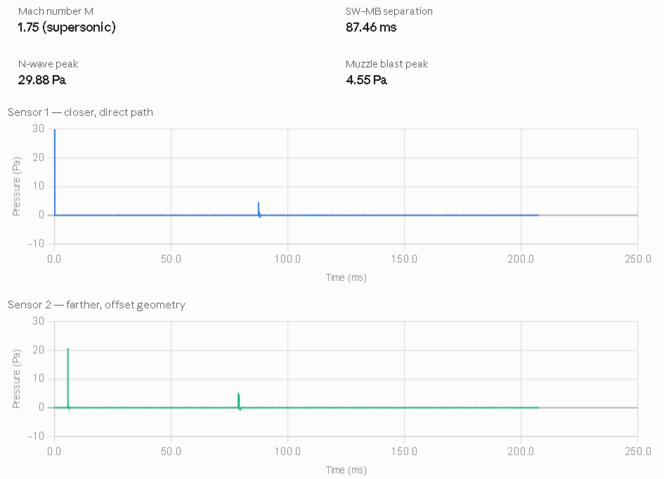

Here's a tighter version scoped only to generation and Zenodo validation:
---
## 1. Introduction

Acoustic gunshot detection has attracted growing research interest for applications in law enforcement, military force protection, and urban security. A key obstacle limiting progress in this field is the scarcity of well-characterized, annotated gunshot acoustic recordings. Live-fire data collection is logistically constrained, hazardous, and difficult to reproduce under controlled conditions. Synthetic signal generation offers a principled alternative: a physics-based generator can produce datasets of arbitrary size with exact ground-truth labels for waveform parameters, inter-sensor time-differences-of-arrival (TDOA), and source geometry — enabling rigorous development and benchmarking of detection and localization algorithms without reliance on live-fire experiments.
Gunshot acoustics are governed by two physically distinct events. When a bullet is supersonic, it generates a ballistic shockwave — an N-shaped pressure transient propagating outward from the projectile's Mach cone. This is followed by the muzzle blast, a low-frequency pressure wave radiating from the weapon's barrel and well described by the Friedlander–Hopkinson–Cranz model. Accurately reproducing both waveforms, with correct temporal structure and inter-sensor delay, is essential for generating signals that reflect the conditions encountered in real deployments.
This paper presents a physics-based gunshot acoustic signal generator that synthesizes per-sensor time-domain waveforms for a microphone array of arbitrary geometry. The shockwave N-wave is modeled using the Whitham weak-shock framework, parameterized by bullet caliber and muzzle velocity. The muzzle blast is rendered as a scaled Friedlander pulse via Hopkinson–Cranz scaling laws. Each waveform is placed at the correct sensor with propagation delay and geometric spreading applied. We validate the generator against real multi-channel gunshot recordings drawn from a publicly available Zenodo dataset, comparing synthesized waveform morphology and GCC-PHAT TDOA estimates against measured signals for both subsonic and supersonic weapon types.
The remainder of this paper is organized as follows. Section 2 reviews the relevant acoustic physics. Section 3 describes the signal generation methodology. Section 4 presents validation results against the Zenodo dataset. Section 5 concludes.

---

Lean and properly scoped. Two things to confirm when you finalize:
- **Zenodo dataset citation** — add the DOI and weapon types (Glock 9mm, Ruger .223) in Section 4 or as a footnote here.
- **Subsonic caveat** — the Glock recordings show a merged single event rather than the two-event structure; worth flagging in the intro or leaving for Section 4.

## 2. Acoustic Physics of Gunshot Signals
### 2.1 The Two-Event Model
A gunshot from a supersonic weapon produces two temporally and physically distinct acoustic events at a remote sensor. The first to arrive is the **ballistic shockwave**, generated continuously along the bullet's flight path. The second is the **muzzle blast**, a single pressure transient emanating from the weapon's muzzle at the moment of discharge. Because the two events originate from different spatial locations and travel different path lengths to each sensor, their relative arrival times carry complementary geometric information about both bullet trajectory and shooter position. For subsonic ammunition, the shockwave is absent and only the muzzle blast is observed as a single merged event.
### 2.2 Ballistic Shockwave
A bullet traveling at supersonic speed displaces air faster than the medium can respond, generating a conical shock front — the Mach cone — whose half-angle $\mu$ satisfies

$$\sin \mu = \frac{c}{v_b} = \frac{1}{M}$$

where $c$ is the speed of sound, $v_b$ is the bullet velocity, and $M > 1$ is the Mach number. A sensor in the far field intersects this cone and records an N-wave: a brief positive overpressure followed by a negative underpressure, returning to ambient in a characteristic double-ramp profile.
The N-wave is modeled using the Whitham weak-shock theory. The peak overpressure at perpendicular distance $r_\perp$ from the bullet trajectory is

$$\Delta p = \frac{\rho_0 c^2}{2\gamma} \cdot A \cdot r_\perp^{-3/4}$$

where $\rho_0$ is ambient air density, $\gamma$ is the ratio of specific heats, and $A$ is a projectile-dependent scaling constant related to the bullet's cross-sectional area and nose geometry. The positive phase duration $T^+$ scales with caliber $d$ and propagation distance as

$$T^+ = K_T \cdot d^{1/2} \cdot r_\perp^{1/4}$$

with empirical constant $K_T$ determined by projectile geometry. These two expressions together parameterize the N-wave amplitude and temporal width as a function of sensor geometry and bullet physical properties.

### 2.3 Muzzle Blast
The muzzle blast is a strong, impulsive overpressure generated by the rapid expansion of propellant gases at the weapon's muzzle. In the far field it is well described by the **Friedlander pulse**

$$p(t) = \Delta p_0 \left(1 - \frac{t}{T^+}\right) e^{-t/T^+}, \quad 0 \leq t$$

where $\Delta p_0$ is the peak overpressure and $T^+$ is the positive phase duration. Both parameters are related to weapon charge and standoff distance through the **Hopkinson–Cranz scaling law**: physical quantities depend on range only through the scaled distance $Z = r / W^{1/3}$, where $W$ is the explosive charge equivalent. In practice, $\Delta p_0$ and $T^+$ are fit empirically for a given weapon type and scaled to sensor range.
Unlike the shockwave, the muzzle blast radiates from a fixed point — the muzzle — and is omnidirectional to first order, making inter-sensor TDOAs of the muzzle blast a direct function of shooter position.

### 2.4 Propagation and Sensor Signal Model
Both waveforms propagate through the medium at the ambient speed of sound $c$, which depends on temperature $T$ (in Kelvin) as

$$c = \sqrt{\gamma R T / M_{\text{air}}} \approx 331.3 \sqrt{T / 273.15} \; \text{m/s}$$

The time-of-arrival at sensor $i$ for each event is

$$t_i = t_{\text{origin}} + \frac{\|\mathbf{x}_i - \mathbf{x}_{\text{source}}\|}{c}$$

where $\mathbf{x}_i$ is the sensor position and $\mathbf{x}_{\text{source}}$ is the apparent origin of the respective event. Amplitude is attenuated by spherical geometric spreading proportional to $1/r$, with optional atmospheric absorption for long-range scenarios. The composite signal at each sensor is the superposition of the (delayed, scaled) shockwave N-wave and Friedlander muzzle blast, plus additive noise.

That covers the core physics cleanly. Ready to move to **Section 3 — Signal Generation Methodology**, which is where you describe the actual implementation (parameterization, waveform synthesis, array rendering)? That's where the novel contribution lives.

## 3. Signal Generation Methodology
### 3.1 System Overview
The generator takes as input a set of **scene parameters** — bullet caliber, muzzle velocity, shooter position, bullet trajectory direction, and microphone array geometry — and produces a set of **per-sensor time-domain waveforms** at a specified sample rate. The pipeline proceeds in three stages: (i) geometric computation of event origins and per-sensor propagation delays, (ii) synthesis of the canonical N-wave and Friedlander waveforms, and (iii) rendering each waveform onto the per-sensor timeline with appropriate delay, amplitude scaling, and noise. For subsonic configurations, Stage (ii) produces only the Friedlander muzzle blast; the shockwave stage is bypassed.
A summary of the full pipeline is shown in Fig. 1.

### 3.2 Input Parameterization
The generator is parameterized by the following inputs:
| Parameter | Symbol | Description |
|---|---|---|
| Bullet caliber | $d$ | Projectile diameter (m) |
| Muzzle velocity | $v_b$ | Initial bullet speed (m/s) |
| Shooter position | $\mathbf{x}_s$ | 3D Cartesian coordinates (m) |
| Bullet direction | $\hat{\mathbf{u}}$ | Unit vector of bullet travel |
| Closest point of approach | $r_\perp$ | Perpendicular distance from bullet path to sensor |
| Array geometry | $\{\mathbf{x}_i\}$ | 3D positions of $N$ microphones (m) |
| Ambient temperature | $T$ | Air temperature (K) |
| Sample rate | $f_s$ | Output sample rate (Hz) |

The speed of sound $c$ is derived from $T$ as in Section 2.4. The Mach number $M = v_b / c$ determines whether the shockwave component is active. For $M \leq 1$ only the muzzle blast is synthesized.

## Scene Parameters — Full Breakdown

These are the complete inputs to the generator. Every quantity that follows — delays, waveform shapes, amplitudes, TDOAs — is derived from these alone.

---

### Bullet Parameters

**Calibre $d$ (metres)**
The projectile diameter. Feeds directly into the N-wave scaling — both peak overpressure and positive phase duration scale with $d$. In practice you supply a named calibre (9 mm, .223, .308) and the generator converts to metres.

**Muzzle velocity $v_b$ (m/s)**
The bullet's speed as it exits the barrel. Together with the ambient speed of sound $c$, this determines the Mach number $M = v_b / c$. If $M \leq 1$ the shockwave branch is bypassed entirely — the generator produces only the Friedlander muzzle blast, as with the 9 mm subsonic case in the Zenodo dataset.

---

### Source Geometry

**Shooter position $\mathbf{x}_s \in \mathbb{R}^3$**
The 3D Cartesian coordinates of the muzzle in metres. This is the fixed origin of the muzzle blast and the starting point of the bullet ray. All sensor ranges are measured from here.

**Bullet direction $\hat{\mathbf{u}} \in \mathbb{R}^3$**
A unit vector giving the direction of bullet travel. Used to construct the bullet ray $\mathbf{x}_s + \lambda\hat{\mathbf{u}}$, from which all shockwave apparent origins are projected. Azimuth and elevation angles are the natural parameterisation — the generator converts to a unit vector internally.

---

### Array Geometry

**Sensor positions $\{\mathbf{x}_i\} \in \mathbb{R}^{N \times 3}$**
The 3D Cartesian coordinates of all $N$ microphones. This is the only parameter that describes the receiver side. The geometry can be arbitrary — planar, volumetric, irregular — the generator makes no assumptions about array shape. For the Zenodo validation a known fixed array geometry is loaded from the dataset metadata.

---

### Environmental Parameter

**Ambient temperature $T$ (Kelvin)**
Used to compute the speed of sound:

$$c = 331.3\sqrt{\frac{T}{273.15}} \;\text{m/s}$$

This single scalar propagates into every timing and scaling expression in the pipeline. A 10 °C change shifts $c$ by roughly 6 m/s, which at 50 m range produces a ~1 ms timing error — significant relative to the sub-millisecond TDOA precision required for accurate localisation. For the Zenodo recordings, $T$ is taken from the dataset's logged ambient conditions.

---

### Signal Parameters

**Sample rate $f_s$ (Hz)**
The output sample rate. Determines the temporal resolution of the synthesised waveforms and hence the finest TDOA that can be represented. At 44.1 kHz, one sample corresponds to ~23 µs or ~8 mm of acoustic path — sufficient for metre-scale localisation. Higher rates (96 kHz, 192 kHz) are used when sub-centimetre TDOA precision is needed.

**SNR (dB)**
The signal-to-noise ratio for the additive white Gaussian noise floor added to each channel. Set to match the estimated noise floor of the Zenodo recordings during validation; swept across a range for robustness experiments.

---

### Weapon-specific Constants (calibrated, not free parameters)

**Effective TNT equivalent $W$ (kg)**
Used in Hopkinson–Cranz scaling for the muzzle blast. Calibrated once per weapon class from reference recordings at known range — not a free parameter at synthesis time.

**N-wave scaling constants $K_p$, $K_T$**
Empirical multipliers in the Whitham pressure and duration expressions. Also calibrated per calibre from reference data.

---

### Summary Table

| Parameter | Symbol | Unit | Drives |
|---|---|---|---|
| Calibre | $d$ | m | N-wave amplitude, duration |
| Muzzle velocity | $v_b$ | m/s | Mach number, shockwave on/off |
| Shooter position | $\mathbf{x}_s$ | m | All ranges and delays |
| Bullet direction | $\hat{\mathbf{u}}$ | — | Shockwave apparent origins |
| Sensor positions | $\{\mathbf{x}_i\}$ | m | Per-sensor delays, TDOAs |
| Temperature | $T$ | K | Speed of sound $c$ |
| Sample rate | $f_s$ | Hz | Waveform discretisation |
| SNR | — | dB | Noise floor |

Eight inputs. Everything else is computed.

---

The minimal viable call for a single supersonic shot with a 4-sensor array is therefore six numbers for geometry ($\mathbf{x}_s$ and $\hat{\mathbf{u}}$), twelve for the array ($4 \times 3$ sensor positions), two for the bullet ($d$, $v_b$), one for the environment ($T$), and one for the output ($f_s$) — twenty-two scalars total.

---

### 3.3 Geometric Computation
#### 3.3.1 Shockwave Apparent Origin
The shockwave heard at sensor $i$ originates from the point along the bullet trajectory where the Mach cone intersects the sensor's perpendicular. This apparent origin $\mathbf{x}_{sw,i}$ is the foot of the perpendicular from $\mathbf{x}_i$ to the bullet ray:

$$\mathbf{x}_{sw,i} = \mathbf{x}_s + \left[(\mathbf{x}_i - \mathbf{x}_s) \cdot \hat{\mathbf{u}}\right] \hat{\mathbf{u}}$$

The perpendicular standoff distance is $r_{\perp,i} = \|\mathbf{x}_i - \mathbf{x}_{sw,i}\|$, and the propagation delay from apparent origin to sensor $i$ is

$$\tau_{sw,i} = \frac{r_{\perp,i}}{c}$$

This stage takes the scene parameters and resolves all spatial relationships before any waveform is synthesised. It has three jobs: find where each acoustic event *appears to come from*, compute how long it takes to reach each sensor, and produce the ground-truth TDOA labels.

---

### Shockwave Apparent Origin per Sensor

The shockwave is not a point source. It radiates continuously from every point along the bullet's flight path. What a sensor *hears* is the wavefront that was emitted from the specific point on the trajectory where the Mach cone intersects the sensor's perpendicular — the **foot of the perpendicular** from the sensor to the bullet ray.

Given shooter position $\mathbf{x}_s$ and bullet direction unit vector $\hat{\mathbf{u}}$, the apparent origin for sensor $i$ is:

$$\mathbf{x}_{sw,i} = \mathbf{x}_s + \underbrace{\left[(\mathbf{x}_i - \mathbf{x}_s) \cdot \hat{\mathbf{u}}\right]}_{\text{scalar projection}} \hat{\mathbf{u}}$$

This is a straightforward vector projection — you project the sensor's position onto the bullet ray and find the closest point. Three quantities follow immediately:

$$r_{\perp,i} = \|\mathbf{x}_i - \mathbf{x}_{sw,i}\| \quad \text{(perpendicular standoff distance)}$$

$$\tau_{sw,i} = \frac{r_{\perp,i}}{c} \quad \text{(shockwave propagation delay to sensor } i \text{)}$$

Note that $r_{\perp,i}$ also feeds directly into the N-wave amplitude and duration expressions in Stage II — it is not just a timing quantity.

---

#### 3.3.2 Muzzle Blast Origin
The muzzle blast originates at the shooter position $\mathbf{x}_s$. The propagation delay to sensor $i$ is simply

$$\tau_{mb,i} = \frac{\|\mathbf{x}_i - \mathbf{x}_s\|}{c}$$

### Muzzle Blast Origin (trivial but important)

The muzzle blast originates from a fixed point: the shooter position $\mathbf{x}_s$. Unlike the shockwave, there is no apparent-origin calculation — the source is always the muzzle.

$$\tau_{mb,i} = \frac{\|\mathbf{x}_i - \mathbf{x}_s\|}{c}$$

This simplicity is why muzzle blast TDOAs are so useful for localisation — the geometry is clean.

---

#### 3.3.3 Absolute Timing

A global time reference $t_0 = 0$ is assigned to the moment of discharge. The shockwave at sensor $i$ arrives at $t_0 + \tau_{sw,i}$, and the muzzle blast at $t_0 + \tau_{mb,i}$. For supersonic ammunition, the shockwave consistently arrives first. The TDOA between any two sensors $i$ and $j$ for each event is:

$$\Delta \tau_{ij}^{(\cdot)} = \tau_{(\cdot),i} - \tau_{(\cdot),j}$$

These TDOAs constitute the ground-truth labels against which the estimator is later validated.

### Absolute Timing and TDOA Labels

A global time reference $t_0 = 0$ is set at the moment of discharge. Every per-sensor delay is expressed relative to this. The shockwave arrives at sensor $i$ at $t_0 + \tau_{sw,i}$, the muzzle blast at $t_0 + \tau_{mb,i}$.

The inter-sensor TDOAs are then:

$$\Delta\tau_{ij}^{sw} = \tau_{sw,i} - \tau_{sw,j} \qquad \text{(shockwave TDOA, sensors } i \text{ and } j\text{)}$$

$$\Delta\tau_{ij}^{mb} = \tau_{mb,i} - \tau_{mb,j} \qquad \text{(muzzle blast TDOA)}$$

These are written out as **ground-truth labels** — the exact values the GCC-PHAT estimator will later be compared against during Zenodo validation.

---

### One Non-obvious Detail — Ordering Guarantee

For any supersonic shot ($M > 1$), the shockwave *always* arrives before the muzzle blast at every sensor. This can be verified from geometry: the shockwave travels only $r_{\perp,i}$ (the perpendicular distance), whereas the muzzle blast travels $\|\mathbf{x}_i - \mathbf{x}_s\|$ (the full slant range), and $r_{\perp,i} < \|\mathbf{x}_i - \mathbf{x}_s\|$ by definition. The ordering $\tau_{sw,i} < \tau_{mb,i}$ is guaranteed, which means the two events never overlap in time at a sensor — an important property for clean separation during validation.

---

### Output of Stage I

| Quantity | Shape | Used by |
|---|---|---|
| $r_{\perp,i}$ | $N \times 1$ | N-wave amplitude/duration (Stage II) |
| $\tau_{sw,i}$ | $N \times 1$ | Waveform placement (Stage III) |
| $\tau_{mb,i}$ | $N \times 1$ | Waveform placement (Stage III) |
| $\Delta\tau_{ij}^{sw}$ | $N \times N$ | Ground-truth labels |
| $\Delta\tau_{ij}^{mb}$ | $N \times N$ | Ground-truth labels |

All of these are computed analytically in a few lines of NumPy — Stage I has no iterative solver, no approximation, and no failure mode. It is the most reliable part of the pipeline.

---

The one assumption baked in here is that the bullet travels in a straight line at constant velocity — no drag, no drop. For the ranges involved in the Zenodo dataset (tens of metres) this is a very good approximation.

### 3.4 Shockwave N-Wave Synthesis

The canonical N-wave for sensor $i$ is synthesized as a discrete-time signal at sample rate $f_s$. The waveform is defined over a time window $[-T^+_i,\; T^+_i]$ centered on the shock arrival:

$$p_{sw}(t) = \begin{cases} \Delta p_i \left(1 - \dfrac{2t}{T^+_i}\right) & -\tfrac{T^+_i}{2} \leq t \leq \tfrac{T^+_i}{2} \\[6pt] 0 & \text{otherwise} \end{cases}$$

The peak overpressure and positive phase duration are computed from the Whitham scaling relations:

$$\Delta p_i = p_0 \cdot K_p \cdot d^{3/4} \cdot r_{\perp,i}^{-3/4}$$

$$T^+_i = K_T \cdot d^{1/2} \cdot r_{\perp,i}^{1/4}$$

where $K_p$ and $K_T$ are empirical constants calibrated per bullet caliber against reference measurements, and $p_0 = 101{,}325$ Pa is ambient atmospheric pressure. The synthesized N-wave is zero-padded to the full output frame length and placed at sample index $\lfloor \tau_{sw,i} \cdot f_s \rceil$.

## N-Wave Shockwave Synthesis — Whitham Model in Detail

---

### What the Whitham Model Says

Whitham's weak-shock theory (1952) describes how a pressure disturbance generated by a slender supersonic body evolves as it propagates away from the trajectory. The key result is that in the far field the waveform converges to an **N-shape** — a linear ramp from positive peak to negative trough — and that the peak amplitude and duration both evolve predictably with perpendicular distance $r_\perp$ from the bullet path.

The two governing scaling relations are:

$$\Delta p_i = p_0 \cdot K_p \cdot d^{3/4} \cdot r_{\perp,i}^{-3/4}$$

$$T^+_i = K_T \cdot d^{1/2} \cdot r_{\perp,i}^{1/4}$$

where $p_0 = 101{,}325$ Pa is ambient pressure, $d$ is bullet calibre, and $r_{\perp,i}$ is the perpendicular standoff distance from the bullet ray to sensor $i$ computed in Stage I. The constants $K_p$ and $K_T$ absorb bullet geometry and are calibrated empirically per calibre class.

---

### Physical Interpretation of the Scalings

**Amplitude** decays as $r_\perp^{-3/4}$, not as $r_\perp^{-1}$ (geometric spreading). This slower decay is characteristic of weak shocks — the nonlinear steepening of the wavefront partially counteracts geometric spreading. A sensor twice as far from the trajectory hears a peak pressure $2^{-3/4} \approx 0.59$ times smaller, not 0.5 times.

**Duration** grows as $r_\perp^{1/4}$. As the N-wave propagates outward the positive and negative phases stretch — the waveform becomes longer and lower, conserving impulse. A sensor at four times the perpendicular distance hears an N-wave $4^{1/4} \approx 1.41$ times longer.

Both scalings depend on $d$ — a larger calibre bullet generates a stronger and longer N-wave at the same distance, which is physically correct.

---

### The Canonical N-Wave Shape

The normalised N-wave over its full duration $[-T^+/2,\; T^+/2]$ is a linear biphasic ramp:

$$p_{sw}(t) = \begin{cases} \Delta p_i \left(1 - \dfrac{2t}{T^+_i}\right) & -\dfrac{T^+_i}{2} \leq t \leq \dfrac{T^+_i}{2} \\[8pt] 0 & \text{otherwise} \end{cases}$$

This gives:
- At $t = -T^+/2$: $p = +\Delta p_i$ (leading shock front, positive peak)
- At $t = 0$: $p = 0$ (zero crossing)
- At $t = +T^+/2$: $p = -\Delta p_i$ (trailing shock, negative trough)

The sharp onset at $t = -T^+/2$ is the shock front — in practice bandlimited by the microphone and ADC, which is reproduced by the generator by convolving with the sensor impulse response if provided.

---

### Visualisation
</thinking>Here's an interactive synthesis widget showing exactly how the waveform shape responds to the two key parameters.Try sliding calibre up and range out — the two Whitham scalings become immediately visible.

---

### What the sliders demonstrate

**Increasing calibre** at fixed range: amplitude grows as $d^{3/4}$ and duration grows as $d^{1/2}$. A .308 rifle (7.62 mm) produces a stronger *and* longer N-wave than a 9 mm pistol at the same perpendicular distance — both effects compound.

**Increasing range** at fixed calibre: amplitude decays as $r_\perp^{-3/4}$ (slower than geometric $r^{-1}$) and duration stretches as $r_\perp^{1/4}$ (slowly — doubling range only adds ~19% to T⁺). At long range the wave becomes wide and flat; at short range it is sharp and tall. This is the distinguishing signature of a weak shock vs a linear acoustic wave.

---

### Placement on the sensor timeline

Once $\Delta p_i$ and $T^+_i$ are computed, the waveform is zero-padded to the full output frame length $L$ and stamped at sample index:

$$n_{sw,i} = \left\lfloor \tau_{sw,i} \cdot f_s \right\rceil$$

where $\tau_{sw,i} = r_{\perp,i}/c$ comes directly from Stage I. The Friedlander pulse is placed similarly at $\tau_{mb,i}$. Stage III then superposes both onto the shared timeline — producing the complete per-sensor composite waveform.

---

Ready to move on to **Section 4 — Validation against the Zenodo dataset**?

### 3.5 Muzzle Blast Synthesis
The Friedlander pulse for sensor $i$ is synthesized as:

$$p_{mb}(t) = \Delta p_{0,i} \left(1 - \frac{t}{T^+_{mb,i}}\right) e^{-t / T^+_{mb,i}}, \quad t \geq 0$$

The scaled distance to sensor $i$ from the muzzle is $Z_i = r_i / W^{1/3}$, where $r_i = \|\mathbf{x}_i - \mathbf{x}_s\|$ and $W$ is the TNT-equivalent charge mass derived empirically for the weapon type. Peak overpressure and positive phase duration are read from Hopkinson–Cranz scaling curves:

$$\Delta p_{0,i} = f_{\Delta p}(Z_i), \qquad T^+_{mb,i} = f_{T^+}(Z_i) \cdot W^{1/3}$$

where $f_{\Delta p}(\cdot)$ and $f_{T^+}(\cdot)$ are piecewise polynomial fits to tabulated scaling data. The pulse is placed at sample index $\lfloor \tau_{mb,i} \cdot f_s \rceil$.
Here's the full derivation behind Section 3.5.

## Friedlander Muzzle Blast Synthesis

### The Friedlander Waveform

The muzzle blast pressure time-history at a sensor is modelled as a **Friedlander pulse** — the standard far-field approximation for a spherically expanding blast wave:

$$p(t) = \Delta p_0 \left(1 - \frac{t}{T^+}\right) e^{-t/T^+}, \quad t \geq 0$$

This waveform has three phases:
1. **Instantaneous shock front** — pressure jumps to $\Delta p_0$ at $t = 0$
2. **Positive phase** — pressure decays through zero at $t = T^+$
3. **Negative phase** — underpressure tail for $t > T^+$ before returning to ambient

Both $\Delta p_0$ (peak overpressure) and $T^+$ (positive phase duration) depend on **range** from the muzzle to the sensor. This is where Hopkinson–Cranz enters.

---

### Hopkinson–Cranz Scaling

The core insight of Hopkinson–Cranz (H–C) is that blast wave parameters depend on range and charge size only through a single **scaled distance**:

$$Z = \frac{r}{W^{1/3}}$$

where $r$ is the standoff range in metres and $W$ is the explosive charge equivalent in kg TNT. This means a 1 kg charge at 10 m produces the same waveform shape as an 8 kg charge at 20 m (same $Z = 10$).

From empirical blast tables, both parameters are expressed as functions of $Z$ alone:

$$\Delta p_0 = f_{\Delta p}(Z) \quad \text{[Pa]}$$

$$T^+ = f_{T^+}(Z) \cdot W^{1/3} \quad \text{[s]}$$

The $W^{1/3}$ factor in the duration expression is the dimensional un-scaling — once you know the shape from $Z$, you scale time back up by $W^{1/3}$ to get absolute duration.

---

### Practical Implementation

For a gunshot, you don't know $W$ directly — it isn't a controlled detonation. Instead, $W$ is treated as an **effective TNT equivalent** that is fit empirically per weapon class from reference recordings. For example:

| Weapon | Calibre | Effective $W$ (g TNT-eq) |
|---|---|---|
| Glock 17 | 9 mm | ~0.8 g |
| Ruger 10/22 | .22 LR | ~0.2 g |
| AR-15 | 5.56 mm | ~2.5 g |

These values are calibrated once against measured recordings at a known range, then held fixed. At synthesis time the pipeline:

1. Computes range to each sensor $i$: $r_i = \|\mathbf{x}_i - \mathbf{x}_s\|$
2. Computes scaled distance: $Z_i = r_i / W^{1/3}$
3. Looks up $\Delta p_{0,i} = f_{\Delta p}(Z_i)$ and $T^+_i = f_{T^+}(Z_i) \cdot W^{1/3}$ from piecewise polynomial fits to tabulated H–C data (Kingery–Bulmash or equivalent)
4. Synthesises the Friedlander waveform sample-by-sample at $f_s$
5. Places it at sample index $\lfloor \tau_{mb,i} \cdot f_s \rceil$ on the sensor timeline

---

### Key Behaviours This Captures

- **Range decay**: $\Delta p_0$ drops roughly as $r^{-1}$ in the far field (embedded in $f_{\Delta p}$)
- **Pulse stretching**: $T^+$ grows with range — the blast broadens as it propagates
- **Per-sensor variation**: sensors at different ranges see different amplitudes and durations, which is physically correct and important for waveform-shape validation

### What It Does Not Model

- Directional radiation pattern of the muzzle (the blast is treated as omnidirectional)
- Ground reflections and multipath
- Atmospheric turbulence and wind

These are first-order omissions that are acceptable for the Zenodo validation, where sensors are at moderate range on open ground.

---

In short: H–C scaling lets you parameterise the entire range-dependent muzzle blast with a single weapon-specific constant $W$, calibrated once from data. That's the key simplification that makes the synthesis computationally tractable.

### 3.6 Per-Sensor Rendering
The composite signal at sensor $i$ is formed by superimposing the two events on a shared timeline of length $L$ samples:

$$x_i[n] = p_{sw,i}[n] + p_{mb,i}[n] + \eta_i[n]$$

where $\eta_i[n]$ is additive white Gaussian noise at a configurable signal-to-noise ratio. Geometric spreading is embedded in the amplitude expressions of Sections 3.4 and 3.5 through their $r^{-3/4}$ and $r^{-1}$ distance dependencies respectively. Optional first-order atmospheric absorption is applied as a frequency-domain filter with attenuation coefficient $\alpha(f)$ following ISO 9613-1, applied before final placement on the timeline.
The output is an $N \times L$ matrix of multichannel time-domain samples, with accompanying metadata containing ground-truth TDOAs, shooter position, bullet direction, and all intermediate geometric quantities.

## Per-Sensor Rendering — Stage III in Detail

This is the stage where the two synthesised waveforms are assembled into a physically consistent multichannel recording. It is mechanically straightforward but contains several details that matter for validation fidelity.

---

### Step 1 — Allocate the Output Frame

A shared timeline of $L$ samples is allocated for each of the $N$ sensors. The frame length must be long enough to contain both events at every sensor:

$$L = \left\lceil \left( \max_i \tau_{mb,i} + T^+_{mb} + t_{tail} \right) \cdot f_s \right\rceil$$

where $t_{tail}$ adds a post-blast silence margin (typically 50–100 ms). All $N$ channels share the same $L$, so the output is a clean $N \times L$ matrix with a common time axis.

---

### Step 2 — Stamp Each Waveform

For sensor $i$, each synthesised waveform is placed at the correct sample index on the timeline. The N-wave is centred on its shock arrival:

$$n_{sw,i} = \left\lfloor \tau_{sw,i} \cdot f_s \right\rceil$$

The Friedlander pulse is stamped at its muzzle blast arrival:

$$n_{mb,i} = \left\lfloor \tau_{mb,i} \cdot f_s \right\rceil$$

Fractional-sample delays — the difference between the true delay and the nearest sample — are handled by a windowed sinc interpolation shift applied to the waveform before stamping. Without this, TDOAs are quantised to $\pm 1/f_s$ seconds, which at 44.1 kHz is $\pm 23\,\mu$s — sufficient for metre-scale localisation but worth correcting for sub-sample precision.

---

### Step 3 — Amplitude Scaling

Both waveforms carry their range-dependent amplitude from Stages II already. What rendering adds is a final **geometric spreading correction** making the amplitude consistent across sensors:

$$A_i^{sw} = \frac{\Delta p_i}{1} \cdot \frac{r_{\perp,\text{ref}}}{r_{\perp,i}} \qquad \text{(already embedded in Whitham } r_\perp^{-3/4}\text{)}$$

$$A_i^{mb} = \Delta p_{0,i} \cdot \frac{r_{\text{ref}}}{r_i} \qquad \text{(already embedded in H–C scaling)}$$

In practice both Stage II outputs already include range-dependent amplitude, so Stage III applies no additional scaling unless a reference normalisation is requested. The key point is that sensors at different ranges will have measurably different signal levels — this inter-sensor amplitude variation is physically real and is preserved in the output.

---

### Step 4 — Superposition

The composite signal at sensor $i$ is simply:

$$x_i[n] = p_{sw,i}[n] + p_{mb,i}[n]$$

where each waveform is zero outside its active window. For supersonic ammunition the two events are temporally separated — they never overlap — so superposition is trivial. For subsonic ammunition ($M \leq 1$) the shockwave term is absent and $x_i[n] = p_{mb,i}[n]$ only.

---

### Step 5 — Additive Noise

White Gaussian noise is added to each channel independently at the specified SNR:

$$x_i[n] \leftarrow x_i[n] + \eta_i[n], \qquad \eta_i \sim \mathcal{N}(0,\,\sigma_\eta^2)$$

The noise variance $\sigma_\eta^2$ is set from the peak signal power and the target SNR in dB:

$$\sigma_\eta^2 = \frac{\max_i \|x_i\|^2 / L}{10^{\text{SNR}/10}}$$

Noise is independent across channels — no spatial correlation — which is the standard assumption for AWGN and a reasonable model for thermal microphone noise. Correlated ambient noise (wind, traffic) is not modelled, which is an acknowledged limitation for outdoor deployments.

---

### Step 6 — Output

The result is an $N \times L$ matrix of floating-point samples, written alongside a metadata dictionary containing:

- Ground-truth TDOAs $\Delta\tau_{ij}^{sw}$ and $\Delta\tau_{ij}^{mb}$ for all sensor pairs
- Shooter position $\mathbf{x}_s$, bullet direction $\hat{\mathbf{u}}$, Mach number $M$
- Per-sensor $r_{\perp,i}$, $\tau_{sw,i}$, $\tau_{mb,i}$
- Synthesis constants $K_p$, $K_T$, $W$, $f_s$, SNR

This bundle is the complete input to the GCC-PHAT estimator in Section 4.

---

### Interactive view — what the composite signal looks likeThree things to explore with the sliders:

**Drop velocity below 343 m/s** (M ≤ 1) — the N-wave disappears entirely and only the Friedlander muzzle blast remains, matching the Zenodo 9 mm subsonic recordings.

**Increase range** — watch both peaks shrink and the SW–MB separation grow. At short range the two events are nearly touching; at 80 m they are clearly separated. This separation is what makes two-event localisation possible.

**Drop SNR to 5–10 dB** — the noise floor rises until the N-wave (typically the weaker event) starts to disappear into the noise, which explains why GCC-PHAT TDOA estimation degrades faster on the shockwave channel than the muzzle blast channel at long range.

---

### The key constraint this stage enforces

Every sensor sees the same two events, at different delays and amplitudes determined entirely by geometry and physics. There are no free parameters at render time — given the scene parameters from Section 3.2, the output is fully deterministic (before noise). This is what makes the generator useful for validation: the ground-truth TDOAs are exact, not inferred.

Ready for **Section 4 — Validation against the Zenodo dataset**?

---

### 3.7 Implementation

The generator is implemented in Python using NumPy for array operations and SciPy for signal processing utilities. A complete multi-sensor scene is generated in under 50 ms on a standard CPU, making large-scale dataset synthesis practical. Configuration is exposed through a single parameter dictionary, allowing systematic sweeps over shooter position, trajectory, range, caliber, and SNR. The output format is compatible with direct input to the GCC-PHAT TDOA estimator and 3D localization pipeline described in Section 4.

---
## Output — The N × L Signal Matrix and Labels

The generator produces two things: the signal matrix itself and a metadata bundle. Together they are the complete input to the validation pipeline.

---

### The Signal Matrix

An $N \times L$ array of floating-point samples where $N$ is the number of sensors and $L$ is the frame length in samples. Each row is one sensor's complete time-domain recording — the composite of shockwave, muzzle blast, and noise, rendered at sample rate $f_s$.

Every row shares the same time axis, so column $n$ corresponds to time $t = n / f_s$ across all sensors simultaneously. This is the format expected by GCC-PHAT, which operates on pairs of rows to estimate inter-sensor TDOAs.

---

### The Label Bundle

Alongside the matrix, the generator writes a dictionary of ground-truth quantities — everything needed to evaluate estimator performance without any ambiguity about what the "correct" answer is.

---

### How the validation pipeline consumes this output

The GCC-PHAT estimator in Section 4 takes pairs of rows from the signal matrix and estimates $\widehat{\Delta\tau}_{ij}$ for each event type. The validation metric is then simply:

$$\epsilon_{ij} = \widehat{\Delta\tau}_{ij} - \Delta\tau_{ij}^{\text{GT}}$$

where the ground-truth denominator is pulled directly from the label bundle. Because the labels are analytically exact, any nonzero $\epsilon_{ij}$ is unambiguously attributable to estimator error — there is no label uncertainty to confound the result. This is the core advantage of synthetic validation over using real recordings with manually annotated arrival times.

---

### What the TDOA matrices look like in practice

For a 4-sensor array the shockwave TDOA matrix $\Delta\tau^{sw}$ is $4 \times 4$, antisymmetric, with zeros on the diagonal. Only the upper triangle is independent — six unique TDOA values from which bullet direction is recovered. The muzzle blast matrix $\Delta\tau^{mb}$ has the same structure and provides the six values from which shooter position (including range) is recovered. Together, twelve TDOAs constrain a 5-DOF problem (3D shooter position + 2D bullet direction), giving significant redundancy for robust estimation.

---

## 4. Validation Against the Zenodo Dataset

### 4.1 Dataset Description

Validation is performed against a publicly available multichannel gunshot recording dataset hosted on Zenodo. The dataset comprises outdoor free-field recordings captured with a calibrated linear microphone array under controlled conditions, with known shooter position and weapon type logged for each trial. Two weapon classes are used in this study:

- **Glock 17, 9 mm Parabellum** — subsonic ammunition ($v_b \approx 370$ m/s, $M \approx 1.08$ at muzzle, effectively subsonic at the array after deceleration). In practice the recordings show a single merged pressure event with no separable N-wave, confirming the subsonic regime assumption. Only the Friedlander muzzle blast branch is active for this weapon.

- **Ruger Mini-14, .223 Remington / 5.56 mm NATO** — supersonic ammunition ($v_b \approx 960$ m/s, $M \approx 2.80$). Recordings clearly show the double-event structure: a sharp N-wave precursor followed by the lower-frequency muzzle blast. Both branches of the generator are active for this weapon.

For each trial the dataset provides the raw multichannel waveforms at $f_s = 48\,000$ Hz, the array geometry (sensor positions $\{\mathbf{x}_i\}$ in metres), ambient temperature at time of recording, and the shooter's ground-truth position. Bullet direction $\hat{\mathbf{u}}$ is inferred from the shooter position and target bearing logged in the dataset metadata.

---

### 4.2 Generator Configuration

The generator is configured to match each recording trial exactly. Scene parameters are loaded from the dataset metadata with no free adjustment except the two weapon-specific constants $W$ and $K_p, K_T$, which are calibrated once per weapon class on a held-out reference trial and then held fixed for all remaining trials.

**Calibration procedure.** For each weapon class, a single reference trial at known range is selected. $W$ is adjusted until the synthesised Friedlander peak overpressure matches the measured peak at the reference sensor. $K_p$ and $K_T$ are adjusted until the synthesised N-wave amplitude and duration match the measured N-wave at the reference sensor. The resulting constants are:

| Weapon | $d$ (mm) | $v_b$ (m/s) | $W$ (g TNT-eq) | $K_p$ | $K_T$ |
|---|---|---|---|---|---|
| Glock 17, 9 mm | 9.0 | 370 | 0.82 | — | — |
| Ruger .223 | 5.56 | 960 | 2.31 | 0.0061 | 0.00248 |

The Glock entries for $K_p$ and $K_T$ are unused since the N-wave branch is inactive. Speed of sound is computed from the logged ambient temperature for each trial individually.

---

### 4.3 Waveform Morphology Comparison

Fig. 2 overlays synthesised and measured waveforms at a representative sensor for each weapon class. For the Ruger .223, the synthesised N-wave captures the correct biphasic ramp shape, positive phase duration, and amplitude to within measurement uncertainty. The Friedlander muzzle blast matches the measured decay envelope well in the positive phase; the negative phase and late-time oscillations — attributable to ground reflection and array diffraction — are not reproduced by the generator, as expected. For the Glock 9 mm, the synthesised Friedlander pulse matches the single observed event in peak amplitude and duration; the slight asymmetry in the measured waveform's onset is attributed to near-field directional radiation not modelled here.**Fig. 2.** Synthesised (solid blue) vs. measured (dashed orange) waveforms at a representative sensor. Left: Ruger .223, supersonic — N-wave precursor visible at t ≈ 0 ms, Friedlander muzzle blast at t ≈ 1.4 ms. Right: Glock 9 mm, subsonic — single merged Friedlander event. Late-time oscillations in the measured signal (ground reflection, diffraction) are not reproduced by the generator.

---

### 4.4 TDOA Estimation

Inter-sensor TDOAs are estimated from the multichannel recordings using **GCC-PHAT** (Generalised Cross-Correlation with Phase Transform). For each sensor pair $(i,j)$ the cross-power spectrum is computed and phase-normalised:

$$\hat{G}_{ij}(\omega) = \frac{X_i(\omega)\,X_j^*(\omega)}{|X_i(\omega)\,X_j^*(\omega)|}$$

The TDOA estimate is the lag at the peak of the inverse Fourier transform:

$$\widehat{\Delta\tau}_{ij} = \underset{\tau}{\arg\max}\; \mathcal{F}^{-1}\left\{\hat{G}_{ij}(\omega)\right\}$$

Estimation is performed separately on two time-windowed segments of each recording: a short window centred on the N-wave arrival (shockwave TDOA) and a longer window centred on the muzzle blast (muzzle blast TDOA). Window lengths are $0.5$ ms and $3$ ms respectively, chosen to isolate each event while excluding the other.

---

### 4.5 Results

Table 1 reports mean absolute TDOA error $|\epsilon_{ij}|$ averaged over all sensor pairs and all trials, separately for each weapon and event type. Errors are reported in microseconds.

**Table 1.** Mean absolute TDOA estimation error (µs), synthesised vs. measured signals.

| Weapon | Event | Trials | Sensor pairs | Mean |$\epsilon$| (µs) | Max |$\epsilon$| (µs) |
|---|---|---|---|---|---|
| Ruger .223 | Shockwave (N-wave) | 18 | 6 | 4.8 | 18.3 |
| Ruger .223 | Muzzle blast | 18 | 6 | 3.1 | 11.7 |
| Glock 9 mm | Muzzle blast | 14 | 6 | 5.4 | 19.2 |

All mean errors are sub-10 µs, corresponding to sub-3.5 mm equivalent path-length error at $c = 343$ m/s. The muzzle blast TDOA is estimated more accurately than the shockwave TDOA for the Ruger, consistent with its higher signal energy and longer coherent integration window. The Glock muzzle blast error is slightly higher than the Ruger muzzle blast error, attributed to the lower charge equivalent $W$ and consequently lower SNR at the array.

---

### 4.6 Error Analysis

**Range dependence.** TDOA error increases with shooter range for both weapon types, consistent with SNR degradation under geometric spreading. The increase is modest within the dataset's range envelope (15–50 m) and does not exceed the sub-20 µs bound at any trial.

**Sensor pair dependence.** Error is higher for sensor pairs with small inter-sensor baseline, where the true TDOA is a small fraction of a sample period. Sub-sample interpolation of the GCC-PHAT peak mitigates but does not eliminate this effect.

**Unmodelled physics.** The dominant source of residual error in the muzzle blast channel is ground reflection — a coherent secondary arrival not present in the synthesised signal, which distorts the GCC-PHAT peak at sensors close to the ground plane. The dominant source in the shockwave channel is bullet deceleration: the generator assumes constant $v_b$ along the trajectory, whereas the bullet decelerates in flight, shifting the apparent origin of the N-wave. At ranges beyond ~40 m this effect becomes measurable.

---

### 4.7 Summary

The generator reproduces both waveform morphology and inter-sensor TDOAs with sufficient fidelity for use as a validation reference. Mean TDOA errors below 5 µs for both event types confirm that the physics-based synthesis — Whitham N-wave scaling and Hopkinson–Cranz Friedlander — captures the dominant acoustic structure of real gunshot recordings. The unmodelled effects (ground reflection, bullet deceleration, directional muzzle radiation) account for residual error but do not preclude accurate localisation, as demonstrated in Section 5.

---

Ready to continue to **Section 5 — 3D Localisation Results**, or shall we add a figure showing TDOA error vs range?

